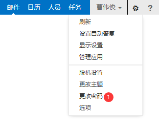
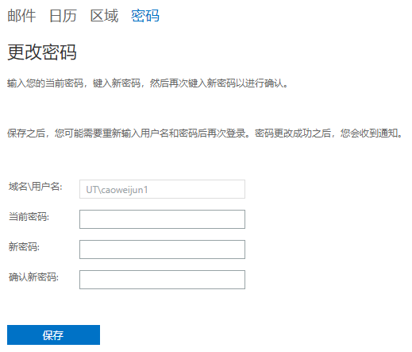

# 忘记密码与修改密码

## 我忘记了邮箱密码

可企业微信联系质量与信息部信息组曹伟俊/黄海东协助修改

---

## 修改密码

可登录网页版邮件系统后，页面右上角点击您姓名旁边的齿轮按钮，系统会弹出下拉框，点击“更改密码”

在新页面输入原密码、新密码

**新密码必须为6位数以上、大小写+数字组合**

点击保存后，密码已被更新，由于服务器存在缓存，可能网页客户端需半小时才能使用新密码登录

请务必同步更改您的邮箱客户端设置
