# 内部使用Outlook连接邮箱

### 先决条件

* 您的计算机已加入公司域（UT.CN)
* 您已使用公司域账号登录计算机
* 您未更改过网卡DNS设置
* *如果您的计算机未加域，请联系质量与信息部信息组进行加域*

### 推荐的客户端

* Outlook 2013 或以上
* Outlook 365
* 由于微软已停止对Office 2010支持，信息组不再推荐安装Office 2010,详见：[微软生命周期策略](https://docs.microsoft.com/zh-cn/lifecycle/products/microsoft-office-2010)

### Outlook 2019或以上、Office 365

打开Outlook，系统自动发现所登录账户绑定的邮箱，**点击高级选项，勾选“让我手动设置我的账户”**，然后点击“连接”

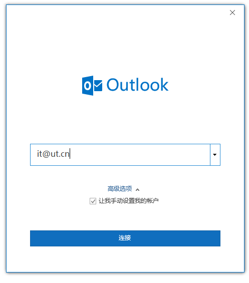

选择Exchange，如果是Office 2021请选择“Exchange 2013或更早版本”

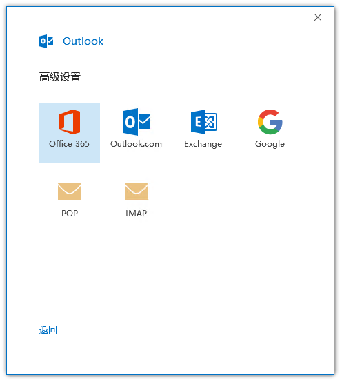

系统自动配置完成，点击“已完成”即可进入Outlook主页面进行收发邮件

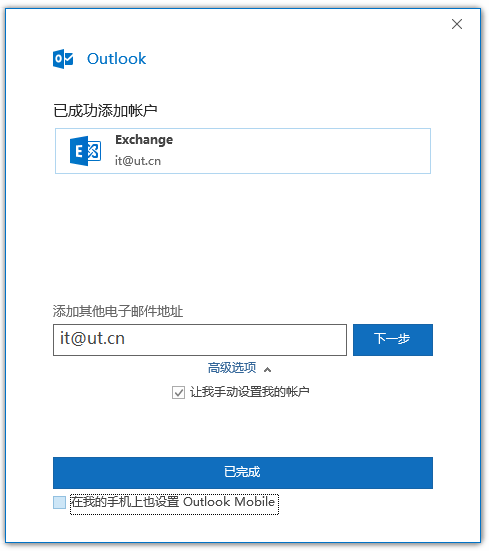

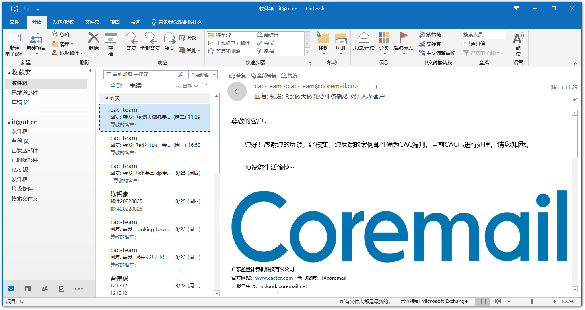

### Outlook 2016

打开Outlook 2016，软件进入向导启动界面

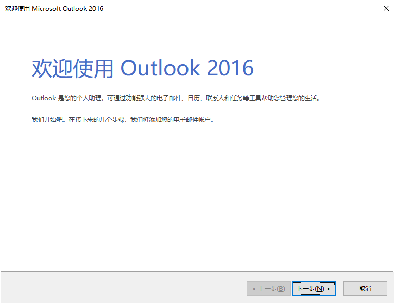

点击下一步，在询问界面选“是”

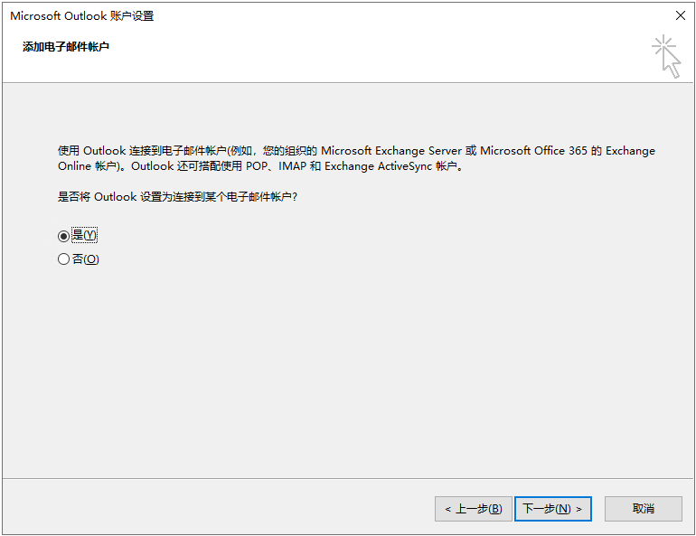

自动账户配置会发现所登录账户绑定的邮箱，并进行自动配置，点击“下一步”即可

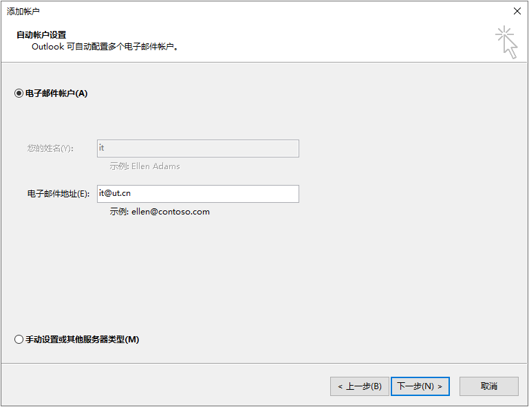

软件自动配置成功，点击完成进入Outlook主界面，此时可正常收发邮件

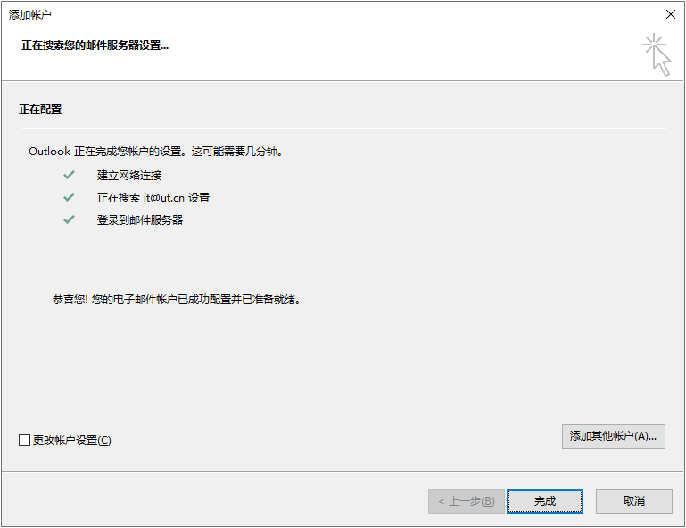

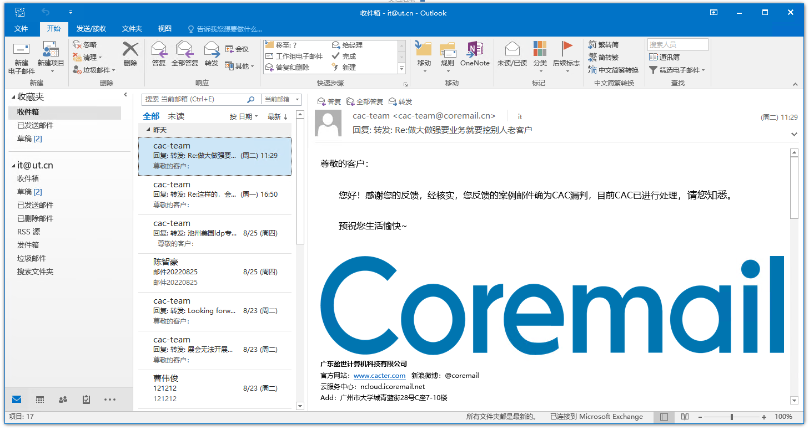

### Outlook 2013

打开Outlook 2013，软件进入向导启动界面

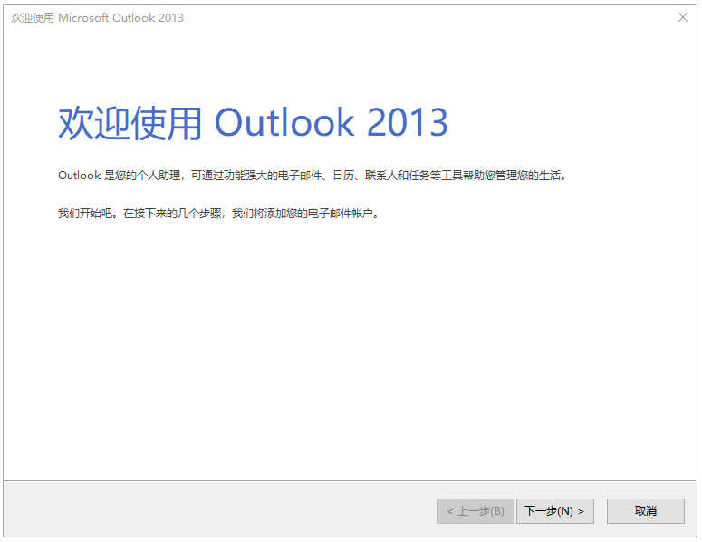

点击下一步，在询问界面选“是”

自动账户配置会发现所登录账户绑定的邮箱，并进行自动配置，点击“下一步”即可

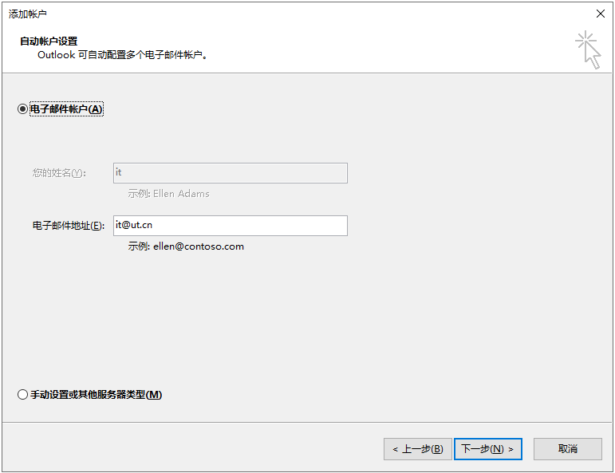

软件自动配置成功，点击完成进入Outlook主界面，此时可正常收发邮件

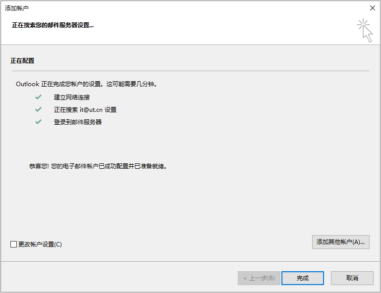

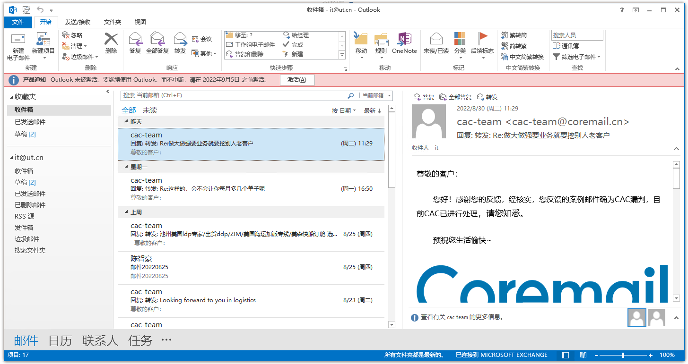

### Outlook 2010

打开Outlook 2010，软件进入向导启动界面

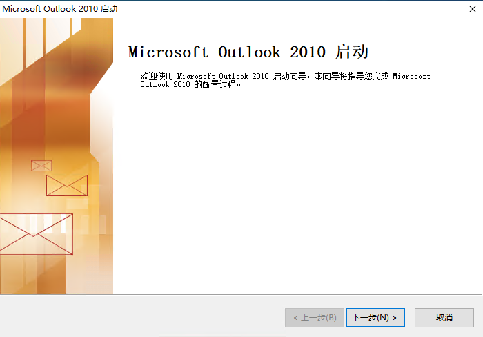

点击下一步，在询问界面选“是”

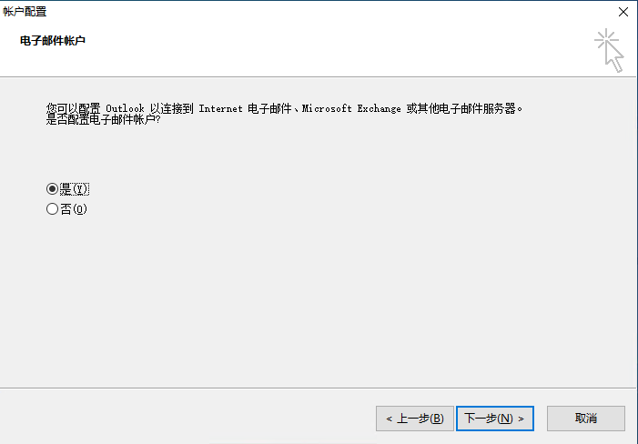

在电子邮件账户设置界面保持默认，点击“下一步”

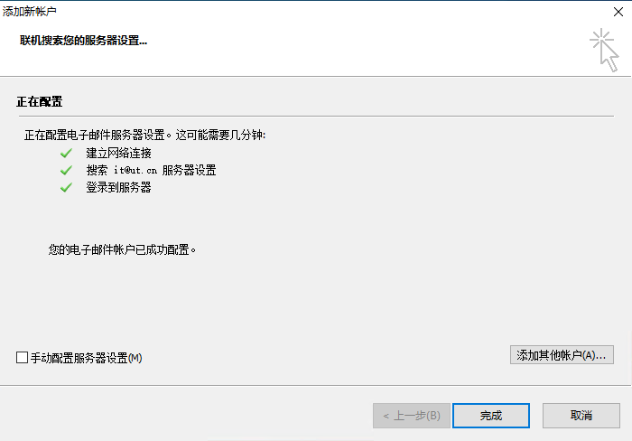

软件自动发现账户并配置，点击完成即可进入Outlook

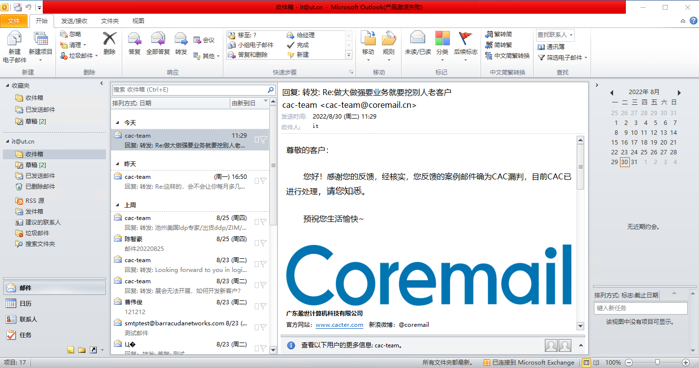
