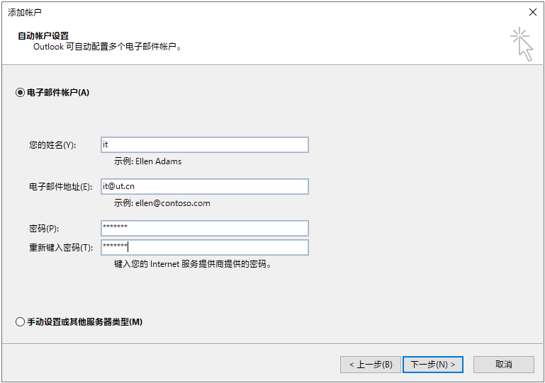

# 外部使用Outlook连接邮箱

### 先决条件

* 您是外部工程/销售同事，并且不在优特金鼎科技园上班
* 您想在家里使用Outlook连接公司邮箱
* 您使用的是未加域的笔记本电脑，希望实现笔记本办公

### 推荐的客户端

* Outlook 2016 或以上
* Outlook 365
* 由于微软已停止对Office 2010支持，信息组不再推荐安装Office 2010,详见：[微软生命周期策略](https://docs.microsoft.com/zh-cn/lifecycle/products/microsoft-office-2010)

Outlook 2019及以上

进入Outlook，添加账户，填入您的邮箱地址，**点击高级选项，勾选“让我手动设置我的账户”**，然后点击“连接”

在弹出的高级界面点击“Exchange 2013或更早版本”

如果是Outlook 2019，请选择“Exchange”

在弹出登录界面，输入您的邮箱密码，并勾选“记住我的凭据”

如果软件多次弹出，请重复输入

稍等片刻后，系统配置完成，此时即可进入Outlook进行邮件收发

### Outlook 2016

打开Outlook 2016，软件进入向导启动界面

点击下一步，在询问界面选“是”

点击“电子邮件账户”，然后填入相应信息

> 姓名：您的中文姓名
>
> 电子邮件地址：您的公司邮箱地址，含@ut.cn
>
> 密码：您的邮箱密码

在弹出登录界面，输入您的邮箱密码，并勾选“记住我的凭据”

如果软件多次弹出，请重复输入

稍等片刻后，系统配置完成，此时即可进入Outlook进行邮件收发

