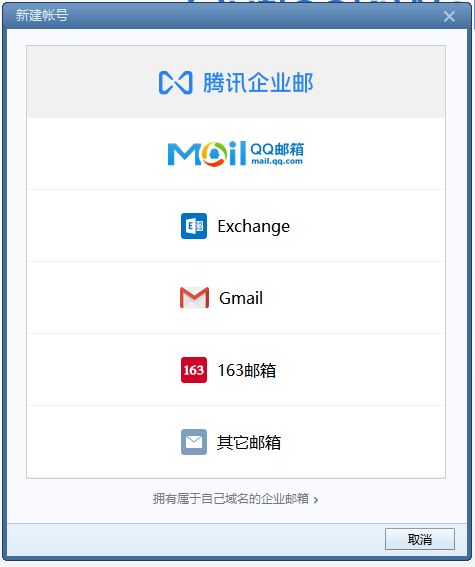
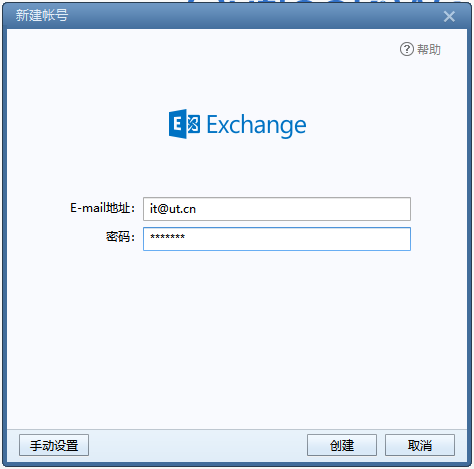
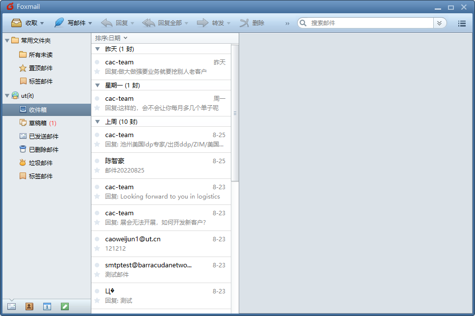

# 使用Foxmail连接邮箱

### 先决条件

* 您是外部工程/销售同事，并且不在优特金鼎科技园上班
* 您想在家里使用Foxmail连接公司邮箱
* 您使用的是未加域的笔记本电脑，希望实现笔记本办公
* **我们不推荐已加域的电脑使用Foxmail连接公司邮箱，请使用Outlook以获得最佳体验**

### 注意事项

由于Foxmail不支持Exchange通讯簿同步，使用Foxmail将无法同步公司企业通讯簿。

导致的结果是您无法查找通讯簿，需要您手动输入同事完整邮箱地址。

### 开始配置

[点击此处](https://www.foxmail.com/)获取最新的Foxmail客户端安装程序

打开Foxmail，进入新建账号界面

在新建账号界面点击“Exchange”，进入帐号密码界面

在此界面输入您的邮箱地址与密码，然后点击创建

稍等片刻后，Foxmail自动配置完成，点击完成即可进入Foxmail主界面收发邮件

