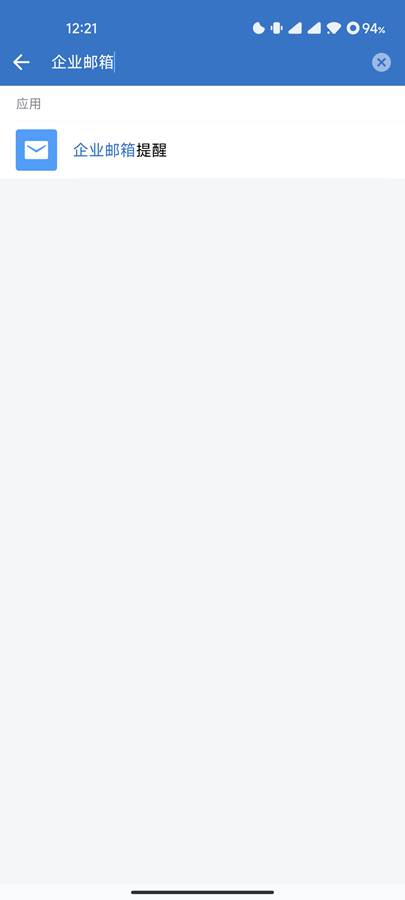
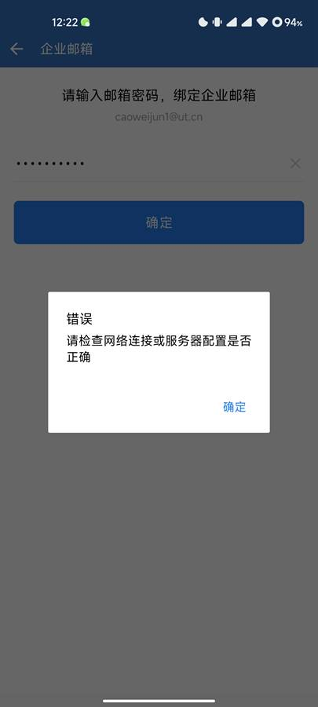

# 通过企业微信接收邮件

打开企业微信，点击右上角放大镜搜索按钮，在搜索框输入“企业邮箱”

系统显示以下对话框，点击“重新设置”连接

在以下界面点击：重新绑定

如果界面显示的邮箱地址有误，请联系质量与信息部信息组林奕松处理

在密码界面输入您的邮箱密码

点击确定按钮后，系统弹出错误提示，再点击“确定”进入自定义设置界面

按以下图片设置服务器地址、端口、SSL后，点击确定

点击确定后，设置成功，企业微信开始收取邮箱信件

