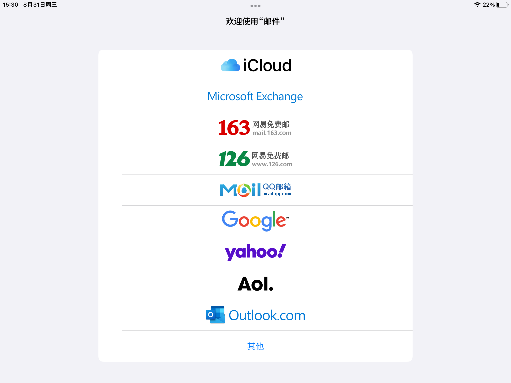
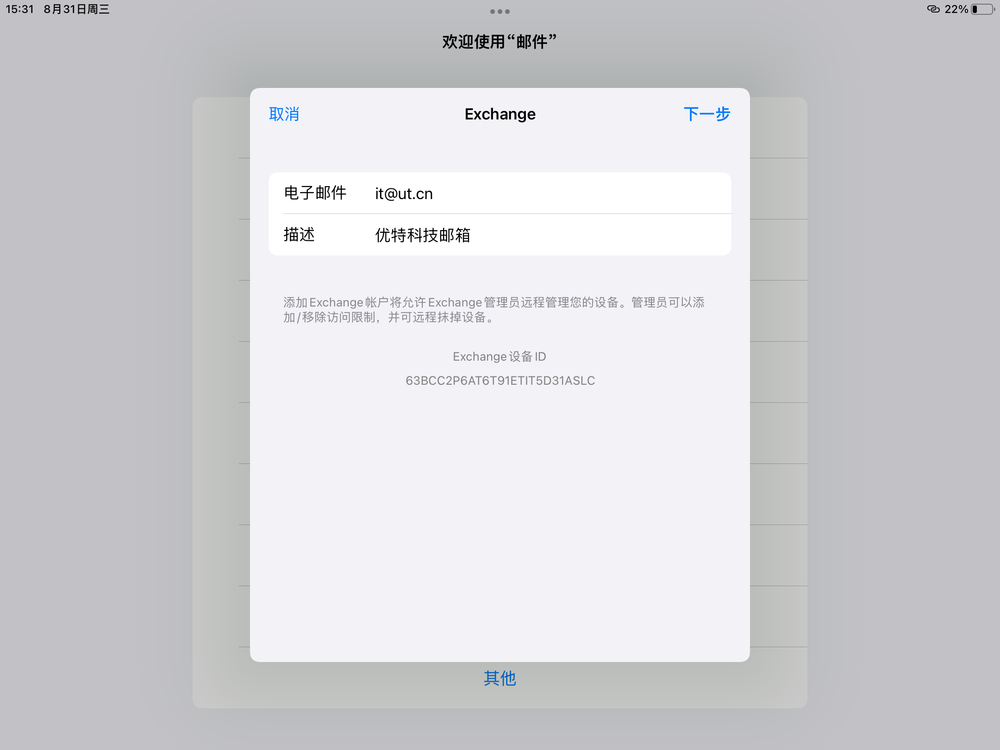
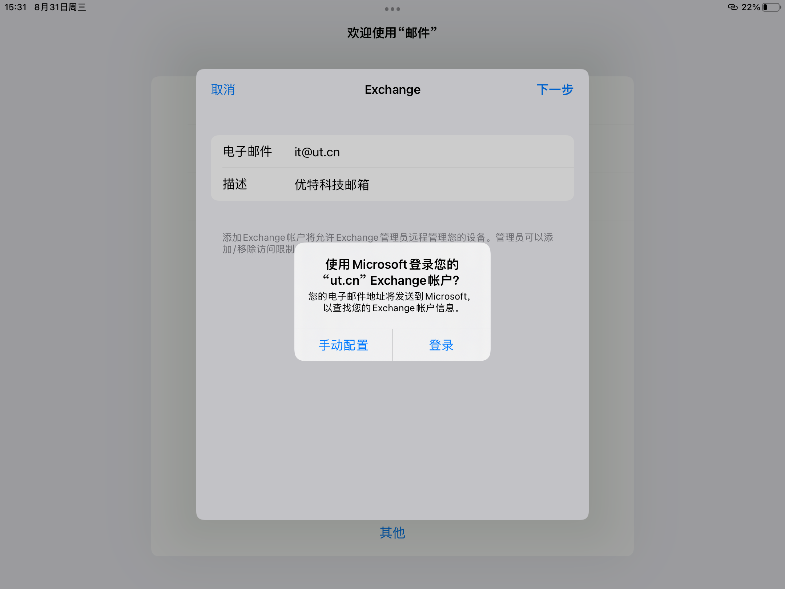
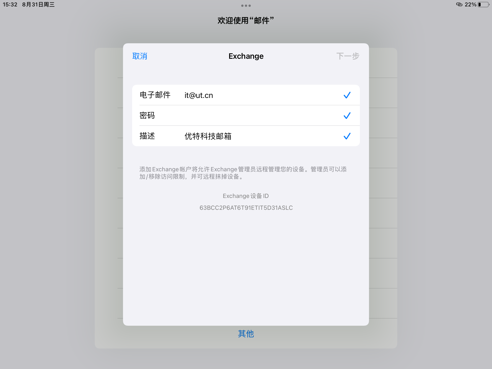
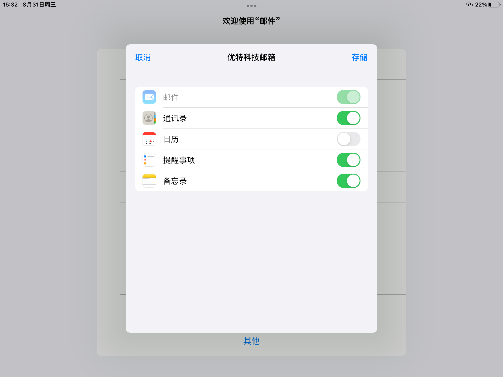
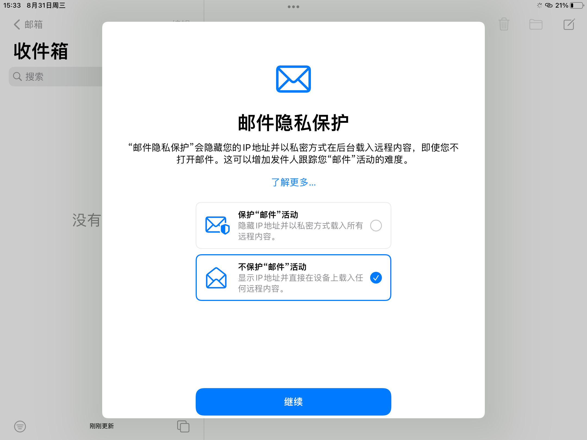
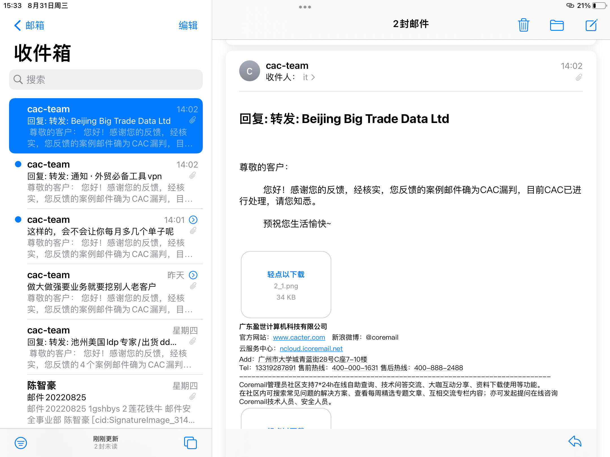

# iOS系统APP收取邮件

先决条件

* 推荐iOS版本为13以上
* 信息组推荐使用iOS自带的“邮件”APP
* 本教程iPhone、iPad均适用

---

### iPad

打开邮件APP，在首页选择“Microsoft Exchange"

在弹出界面输入邮箱完整地址、描述

点击下一步后，系统询问是否用Microsoft查找信息，点击“登录”

点击“登录”后，输入您的邮箱密码

输入密码后点击下一步，如果打勾则表示设置完成

APP自动跳转到同步选项，勾选您需要同步的内容，并点击“存储”

点击“存储”后，APP跳转到收件箱，并弹出隐私设置按钮，请选择“不保护邮件活动”

此时APP已经可以进行邮件收发

