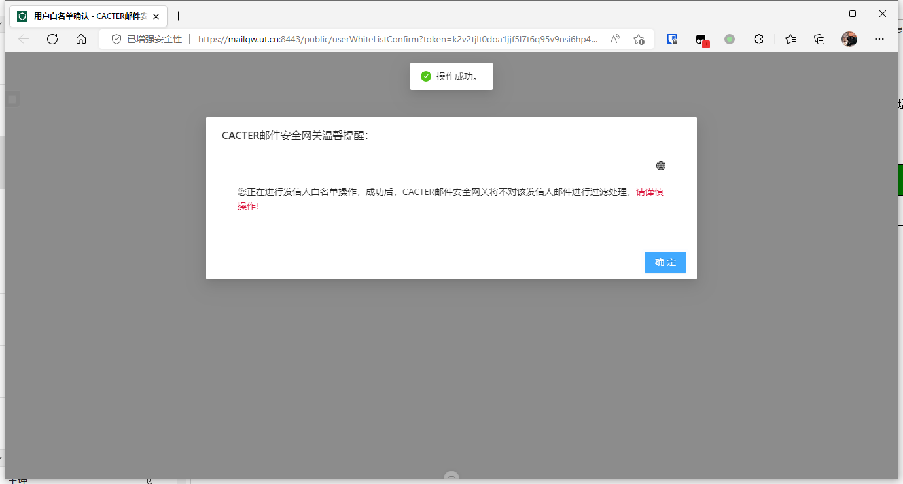

# 垃圾邮件提醒与处理

### 垃圾邮件提醒

网关会在每天9：00、11:00、14:00、17:00以postmaster身份给收到隔离邮件的用户发送一份隔离邮件通知，告知被网关拦截的邮件列表.

隔离邮件通知只会发送该时间段内被隔离的邮件，以前被隔离的邮件不会重复发送通知。如果用户没有对隔离邮件进行投递操作，网关会在30天后删除该封邮件。

网关默认对所有用户启用垃圾邮件隔离功能。如果用户不需要拦截垃圾邮件，可联系信息组进行单独处理。

邮件有取回与白名单两个功能

> 取回：系统将本封邮件取回并投递到收件箱
>
> 白名单：系统将该发信人邮箱加入白名单，往后该发信人投递给您的邮件不再隔离，但该发信人发给其他用户的邮件仍交由系统判断是否隔离

### 取回邮件

在隔离通知邮件内，点击“取回”，软件调用默认浏览器弹出页面，页面显示“成功/Success"即表示成功取回邮件

### 白名单

在隔离通知邮件内，点击“白名单”，软件调用默认浏览器弹出页面

网关会提醒您是否进行发信人白名单操作，如确定加入白名单可点击“确定”

白名单操作不可撤销，如需撤销白名单请联系信息组
