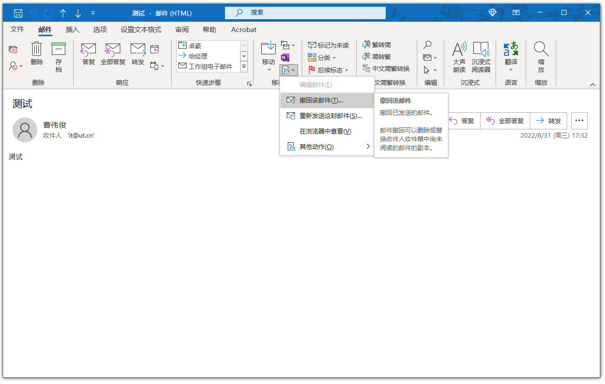

# 邮件撤回

### 什么是邮件撤回

Outlook邮件撤回功能可对公司内部用户已发送的邮件，在对方未阅读的情况下顺利召回。支持单个或者多个收件人的邮件同时召回。

### 我发了信，可是我后悔了，可以撤回吗？

可以撤回，但必须确认满足以下前提条件：对方也是公司内部用户，发送的邮件还处于未读状态。

### 如何撤回邮件

进入发件箱文件夹，双击您刚发送的邮件

点击邮件选项卡 - 移动 - 撤回

