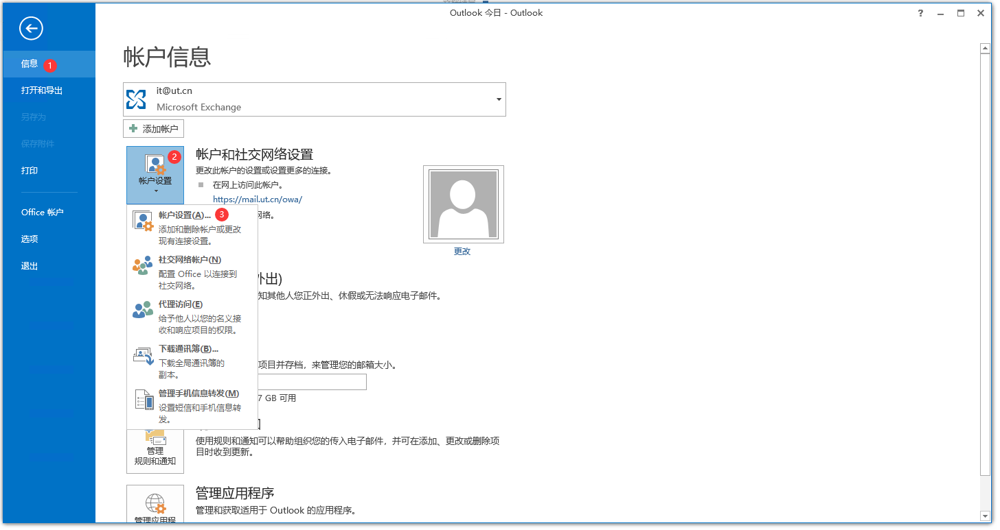
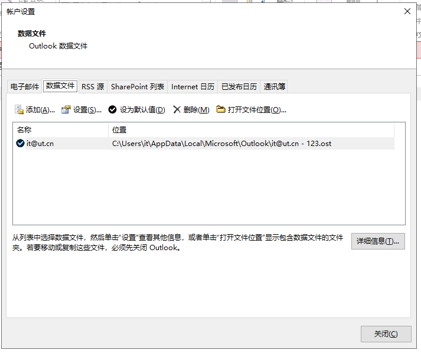
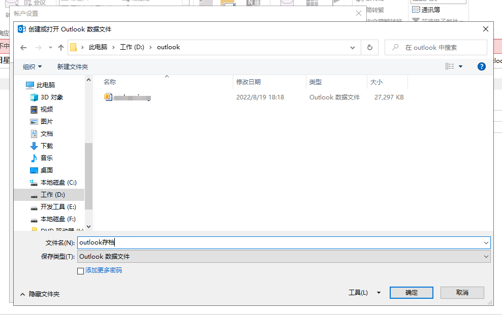
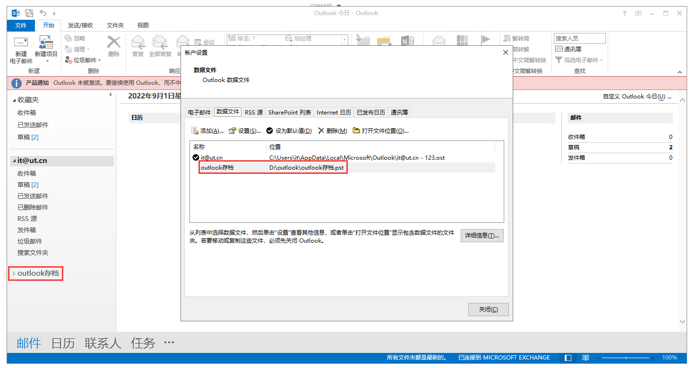
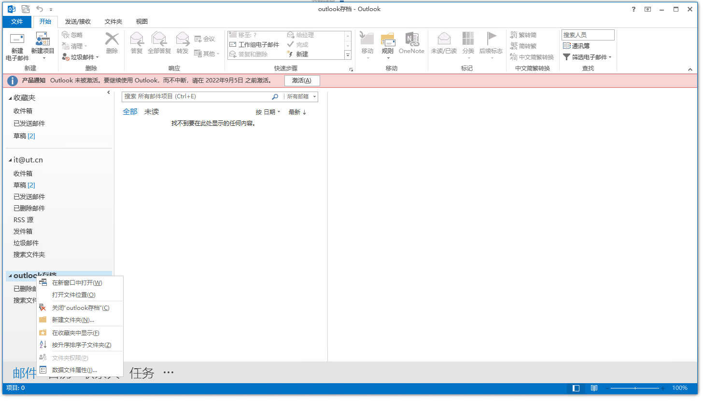
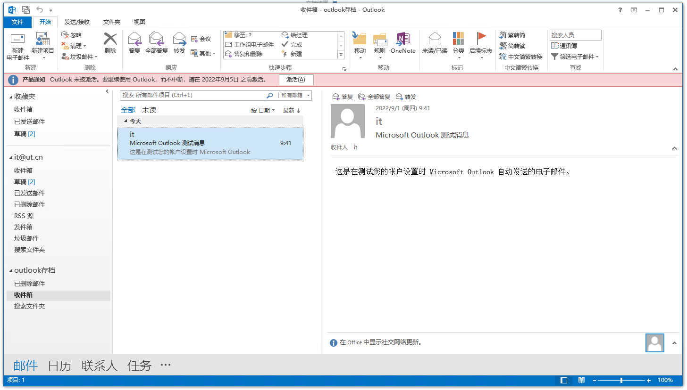
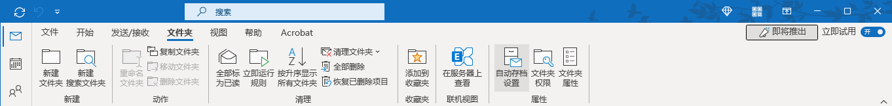
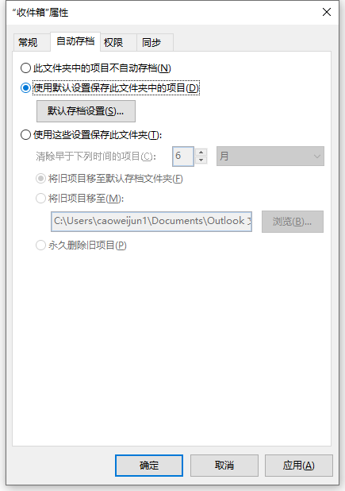

# 如何设置邮件归档？

## 先决条件

* 已安装Microsoft Outlook 2010 或以上

## 您需要注意的事项

* 设置归档后，您无法再从网页与其他电脑客户端查看该封邮件，该封邮件永久存储到您本地计算机磁盘

## 归档方法：

### 设置数据文件

确保您已有Outlook本地数据文件，如无，请按以下方式设置：

1. Outlook左上角文件 - 账户设置 - 账户设置

2. 弹出页面切换“数据文件”选项卡，并点击添加

3. 在非C盘路径存储一个数据文件，文件名请自行设置，然后点击确定，

4. 数据文件创建成功，Outlook主页面与数据文件选项卡已显示您的数据文件

### 开始存档

1. 在主页面存档设置文件夹，如“收件箱”，如已设置请忽略

2. 将联机收件箱文件夹的邮件使用鼠标右键拖动到存档文件夹，即完成存档

### 设置自动归档

本文为可选教程，请按需设置

打开Outlook，切换“文件夹”选项卡，点击“自动存档设置”按钮

点击“使用默认设置保存此文件夹的项目”，点击打开“默认存档设置”

勾选“自动存档时间间隔”，并设置你所期望的间隔天数，

勾选“存档或删除旧项目”，设置“清除早于下列事件的项目”，请按需设置

然后点击“将旧项目移至”，选择浏览按钮，在弹出界面选择你的存档数据文件

至此邮件的自动存档设置完毕，以后outlook会按照上述的存档配置定期自动归档到本地电脑。
