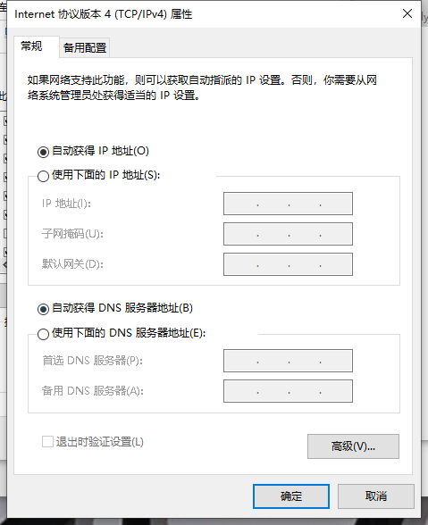
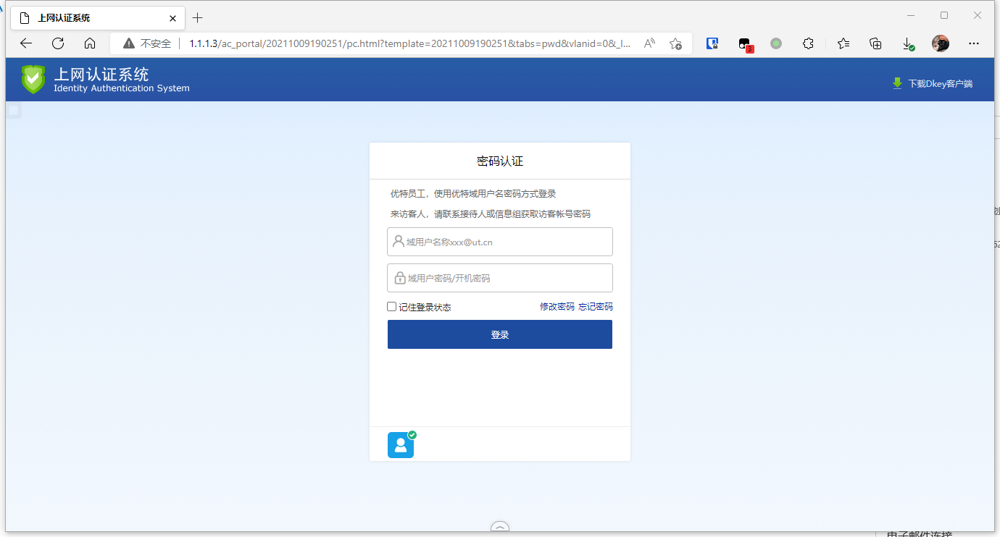
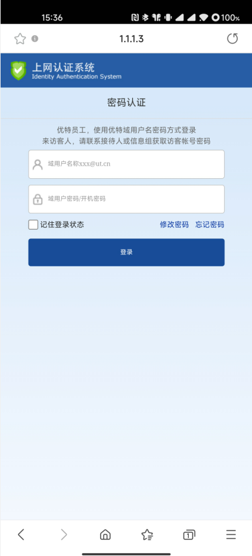

# 园区网络

## 网络建设

### 有线网
#### 高扩展
园区核心交换机采用两台华为S7700系列框式智能路由交换机，支持多个业务扩展槽位，可向40G、100G网络平滑推进

#### 高带宽
园区整网有线网络采用新华三S6520系列交换机实现桌面千兆接入+万兆互联的组网，网络带宽无堵塞

园区Internet网络连接包括电信、联通、移动三网运营商，出口带宽近1Gbps

#### 高防护
园区在网络边界部署了3套深信服下一代防火墙，保障园区网络业务安全运行

### 无线网
公司覆盖办公园区的无线网络（SSID：UTOALAN）采用目前国际最先进的 802.11ax 无线技术，由新华三无线设备组网，支持 2.4/5 GHz 双频段，实现园区的室内覆盖和无缝漫游，并采用无感知认证方式，即一次认证可一直使用无线网络。

#### UTOALAN相关信息
网络标识SSID：UTOALAN

无线标准：IEEE 802.11n/ac/ax

IP设置：自动获取IP地址和DNS服务器地址

#### 覆盖范围
1号楼1-7楼（不含连廊）

2号楼1-7楼

3号楼1-7楼（不含连廊）

## 接入指南

### 有线接入

1. 将本地电脑加域，未加域请联系信息组加域
2. 确保本地电脑网卡IPV4地址设置为“自动获得IP地址”
   
3. 使用网线插入个人卡位含有标识为“TO”的网口插座，如 1-2-B01-***TO***1
4. 等待网卡获取IP地址，获取后，电脑浏览器自动弹出认证界面，如果没有自动弹出认证界面，请使用浏览器打开地址：http://1.1.1.3

5. 在账户与密码框输入您的域账户与密码，然后点击登录
6. 登陆成功，系统自动跳转到浏览器默认页

### 无线接入

1. 笔记本/手机开启WiFi
2. 搜索无线信号：`UTOALAN`
3. 接入`UTOALAN`，密码为:`uttech21`
4. 等待浏览器弹出认证界面，输入您的域账号和密码，然后点击登录

5. 系统退出认证界面，此时可正常上网
