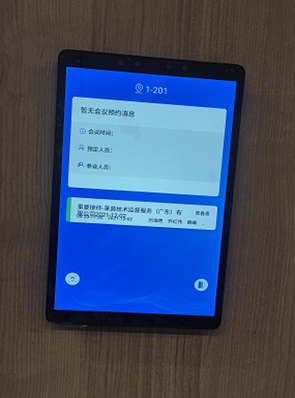
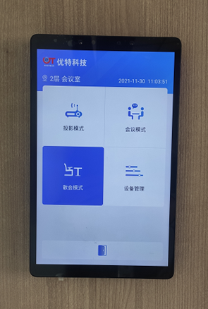

# 会议预约屏与集中控制屏

本文适用于：

智能会议室

VIP会议室

## 会议预约屏

会议预约屏功能：

1.门禁控制：人脸识别或刷卡方式实现会议期间门禁管理。

2.会议信息：显示当前会议或会议预约信息。

## 集中控制屏

会议室集控屏功能：

1.投影模式：适用于投屏会议，电视机打开，窗帘放下，灯光变暗。

2.会议模式：适用于交谈会议，电视机关闭，窗帘收起，灯光打开。

3.散会模式：会议结束后一键关闭会议室设备，窗帘收起。

4.设备管理：会议期间对会议室灯光、空调、窗帘进行控制。

5.门禁控制：集控屏下方开门按钮实现会议室门禁控制
