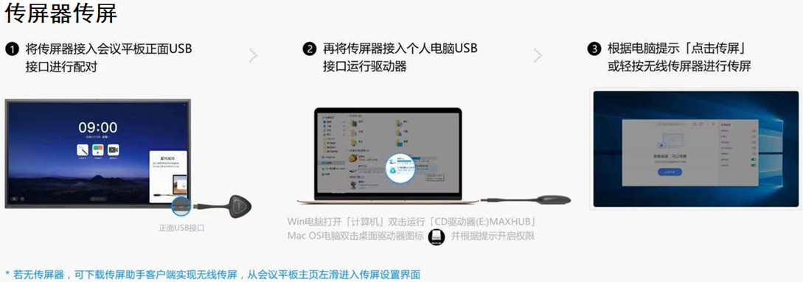
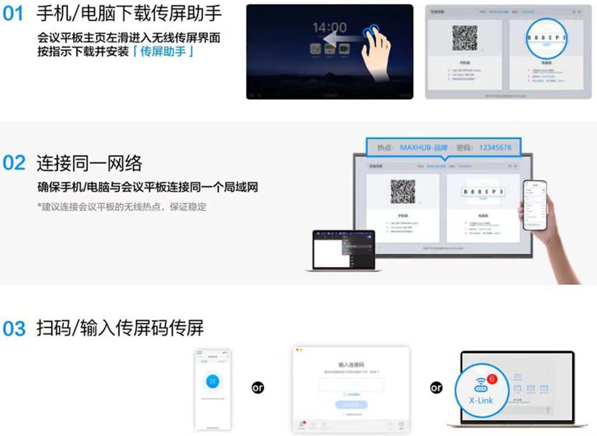

# 会议室快速使用指南

** 投影模式：

此模式适用于需要投屏显示的会议，此模式下会议室的屏幕上电、电动窗帘放下、室内照明关闭、音响系统上电。

** 会议模式：**

此模式适用于交谈会议，此模式下会议室的屏幕关闭、电动窗帘打开、室内照明打开、音响系统上电。

** 散会模式：**

会议结束后，散会模式能将会议室的设备关闭。

** 设备管理：**

会议设备控制可实现：灯光控制、窗帘控制、空调控制与会议设备控制。

注：会议室的空调默认由会议内屏控制，如需修改空调温度请通过设备管理内的空调控制进行调节。

** 开门按钮：**

按压屏幕下方的开门按钮即可打开会议室门禁。

传屏器传屏：

注：1.正常情况下传屏器已经配对完毕，直接从第2步开始执行即可；

2.若传屏器无法正常使用的情况下，从第1步配对开始执行。
** 无线WIFI传屏 **

**或访问
** [**https://www.maxhub.com/downloadcenter/**](https://www.maxhub.com/downloadcenter/)** ** **下载传屏助手**
