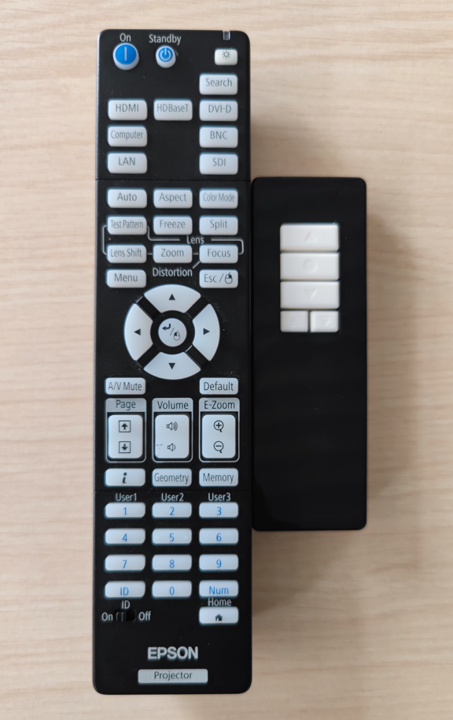

# 3号楼701培训室使用指南

:::note

本文适用于3号楼7楼培训室

:::

## 投影模式

**如果您需要使用音响系统，请务必使用本模式**

### 开启设备

点击控制平板“投影模式”，系统自动开启空调、投影机、音箱系统，并降下投影幕布

### 开始培训及讲话

将HDMI线插入笔记本，系统自动切换HDMI信号投影

提起手持麦克风，长按开关即可开始讲话

### 结束

点击控制平板“散会模式”，系统自动关闭培训室所有电器设备

## 会议模式

### 功能说明

点击控制平板“会议模式”，系统自动开启空调、室内灯光。

此模式下不会开启投影机、音箱系统。

## 设备管理

### 功能说明

在此页面下，可以对空调、灯光、投影进行单独控制，**但无法控制音箱系统**

## 快速排障

如果遇控制平板故障，可手动开启相关设备，并请反馈信息组方岳雄及时进行维修

### 空调系统

会议室共5个空调控制面板，分别在两个大门内侧，可单独控制开关

### 灯光

在培训室后门设有独立灯光控制面板，可单独控制灯光

按压圆圈“3个回路”开关即可控制。

### 投影机与幕布

培训室讲台抽屉有投影机与幕布遥控器各一只，可单独控制

左侧为投影机遥控器，右侧为幕布遥控器

遥控器对准投影机，按下投影机遥控器“On”按钮即可开启投影机，"Standby"为关闭投影机

幕布遥控器有三个长方形按钮，从上到下分别为“上升”、“停止”与“降下”

:::danger

请勿按投影机遥控器其他按钮，避免投影机损坏

:::

### 音响系统

打开设备机柜，设备机柜分别有两台时序电源控制器，请分别点击一次“POWER”按钮，如图所示即为所有开关已闭合，音响系统已开启

如需关闭，再点击一次“POWER”按钮即可

