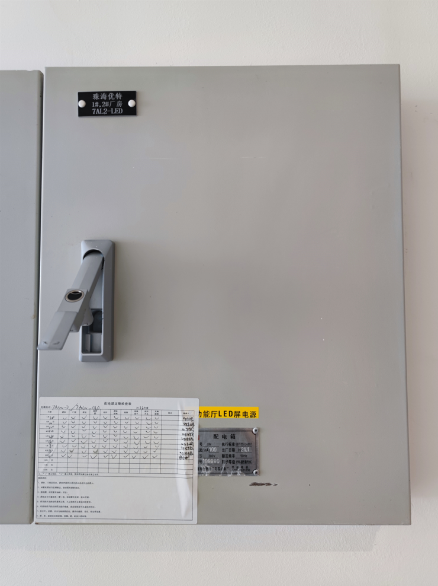
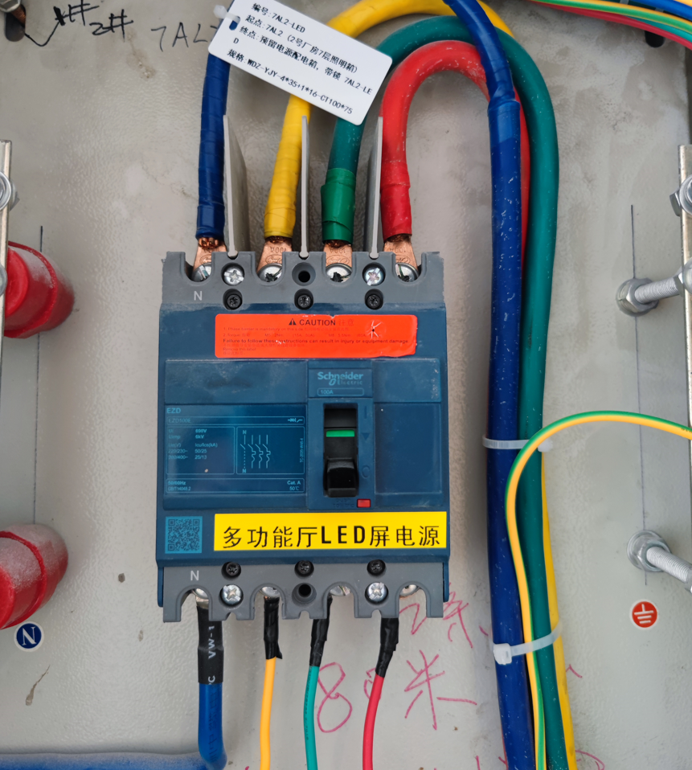
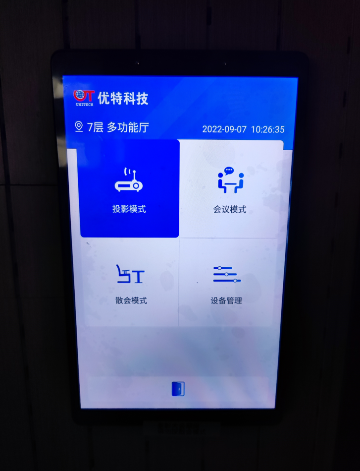
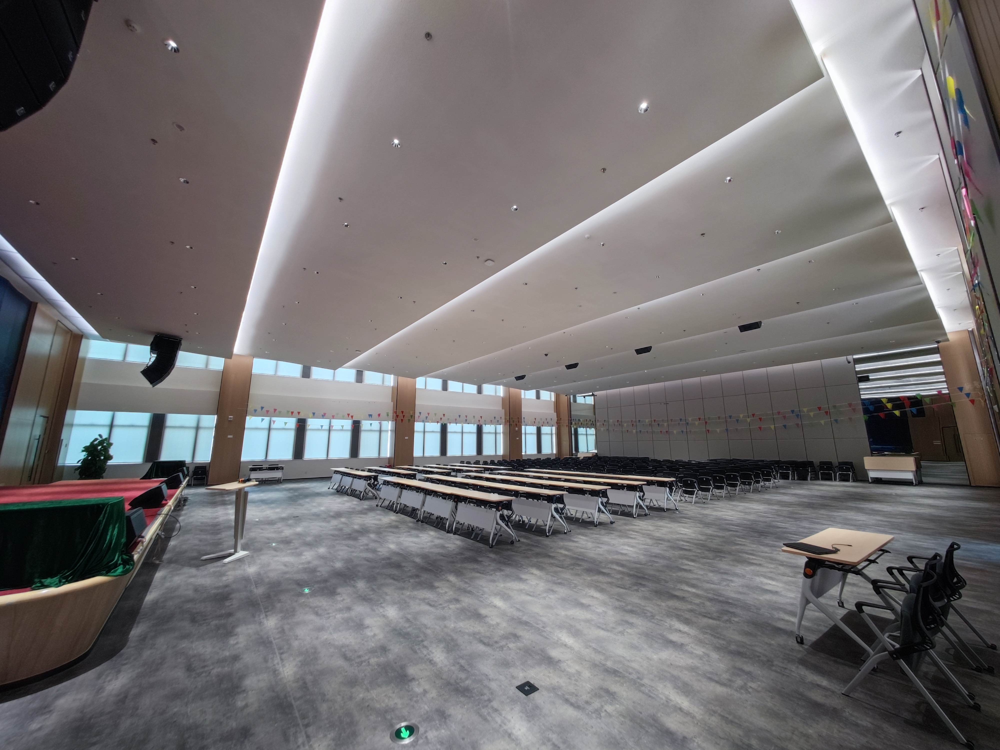
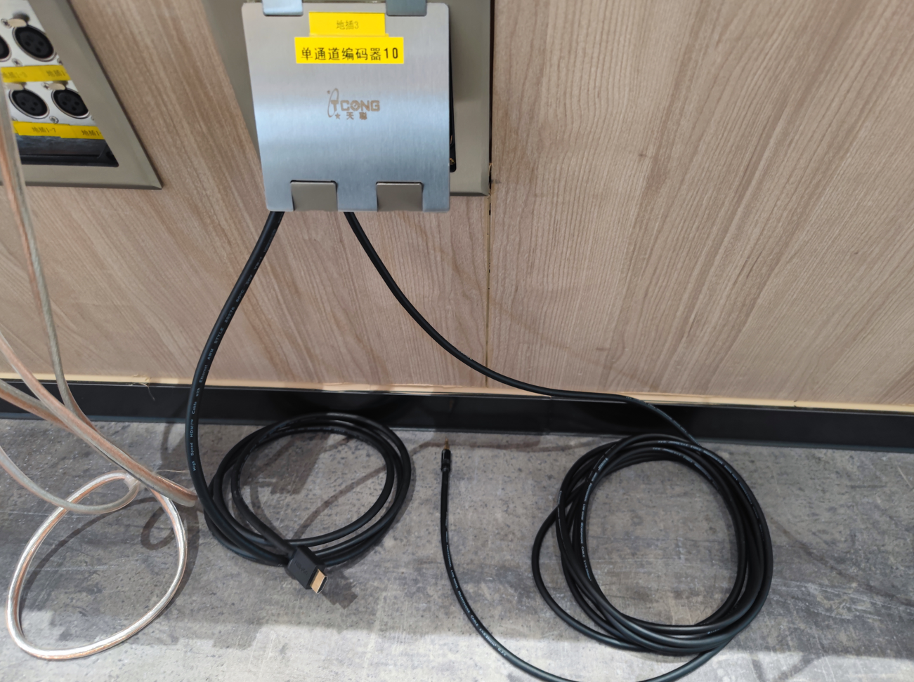

# 3号楼多功能厅使用指南

:::note

本文适用于3号楼7楼多功能厅

:::

# 日常使用

** 请根据本文指示操作开启多功能厅设备 **

## 开启LED大屏

到LED屏墙面后墙，找到标有“多功能厅LED屏电源”配电箱并打开

将断路器开关送上去
:::danger 有电危险

请勿乱触碰，确保手掌干燥

:::

此时LED屏已送电

## 开启音响

点击多功能厅会议平板的“投影模式”

此时多功能厅灯光全开、窗帘全部降下

音箱系统启动大概需要2分钟时间，2分钟后即可使用手提话筒讲话，话筒放置于讲台桌上

**多功能厅话筒使用松下充电电池，请勿擅自更换，如遇多功能厅电池没电，请联系信息组曹伟俊处理**

舞台下方有HDMI连接线与音频线可供员工接笔记本使用

**HDMI接口不可更换，如需更换接口请联系信息组曹伟俊/方岳雄切换信号源**

## 开启空调
请联系总经办后勤组邓木根

## 使用完成

多功能厅使用结束后，点击平板“散会模式”，系统自动关闭所有电器、升上窗帘。

同时，您还需要将LED屏配电箱断路器开关打下来

## 快速排障

### 我需要使用音响同时打开窗帘

请通过会议平板“设备管理” → “窗帘”，点击“升起“按钮，窗帘会全部升起

### 麦克风没有声音

* 确保麦克风电池有电
* 确保控制平板处于“投影模式”

如果会议平板不在会议模式，则可能造成音响系统没有上电。

请点击平板“散会模式”，等候数分钟后，再点击“投影模式”，等候音响系统就绪即可正常使用。
