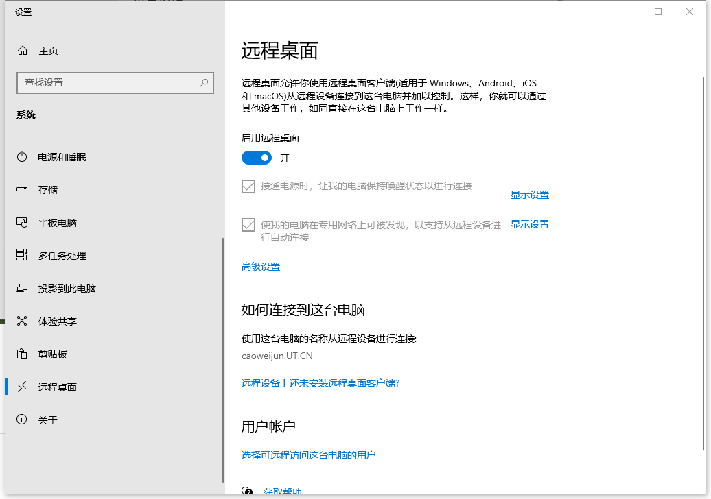
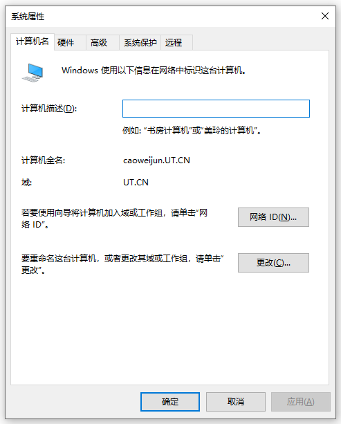
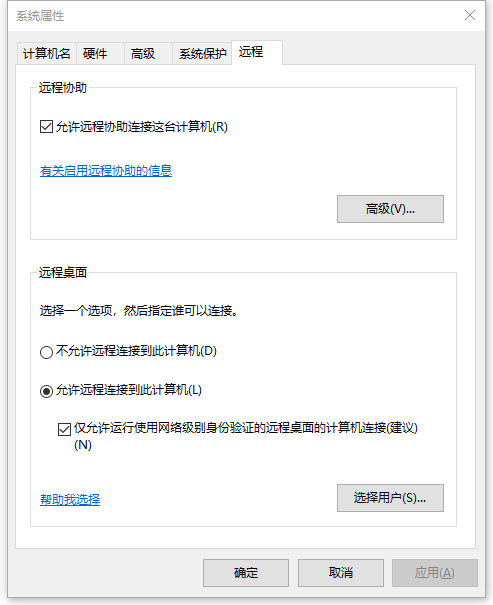

# 如何设置远程桌面

## Windows 10

我的电脑 → 右键属性 → 关于

左侧功能菜单点击“远程桌面”，在远程桌面菜单选择启用

并记下“使用这台电脑的名称从远程设备进行连接”所显示的名称，包含`.ut.cn`

**这个名称就是您客户端远程桌面所需要的计算机名**

## Windows 7

我的电脑 → 右键属性

记下“计算机全名”所显示的名称，包含`.ut.cn`

**这个名称就是您客户端远程桌面所需要的计算机名**

切换“远程”选项卡

点击“允许远程连接到此计算机”，并勾选“仅允许使用网络级别身份验证的远程桌面”

