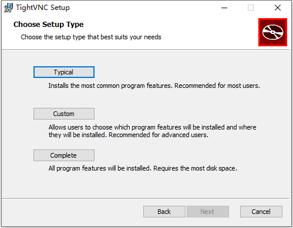
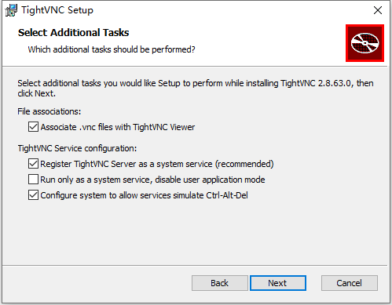
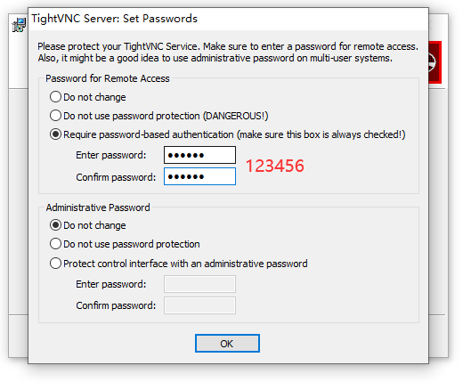
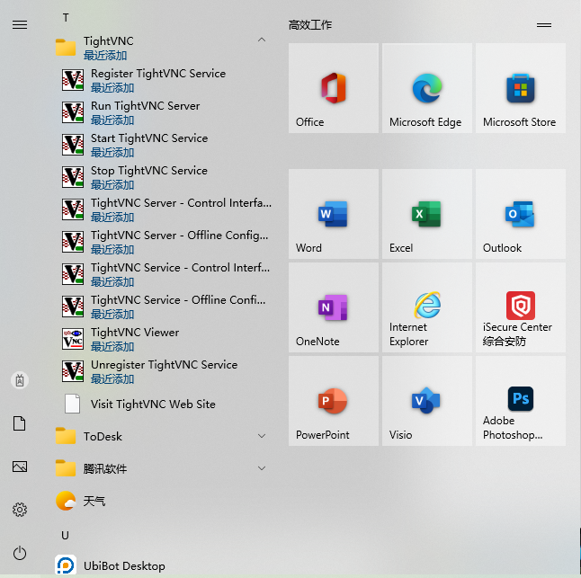

# 新电脑如何加域

## 办法1

1. [参考本文](/question/SSLVPN问题/远程桌面设置)，开启远程桌面
2. [参考本文](/question/网络使用问题/查看ip)，查看电脑IP地址
3. 为您现在使用的账户设置一个登录密码（如有请忽略）
4. 将IP地址、所需设置的计算机名、账户与密码记录联系信息组郑广新 / 曹伟俊 / 黄海东

## 办法2：

1. 打开“我的电脑”，在地址栏中输入`\\192.168.100.5\Tools\常用工具\VNC`并回车，如弹出页面提示输入用户名和密码，请输入您的域账户`@ut.cn`，密码是你域密码/电脑开机密码
2. 双击运行`tightvnc.msi`
3. 一路点击Next即可，在以下界面请点击“typical”
   
4. 保持默认选项，点击Next，开始安装
   
5. 系统提示设置控制密码，请按下图设置
   
6. 点击OK后，系统安装完成。
7. 开始菜单 - TightVNC - Start TightVNC Server
   
8. 鼠标移至系统托盘右下角，有一个"V"图标，会显示电脑IP，将此IP地址、所需设置的计算机名、账户与密码记录联系信息组郑广新 / 曹伟俊 / 黄海东
