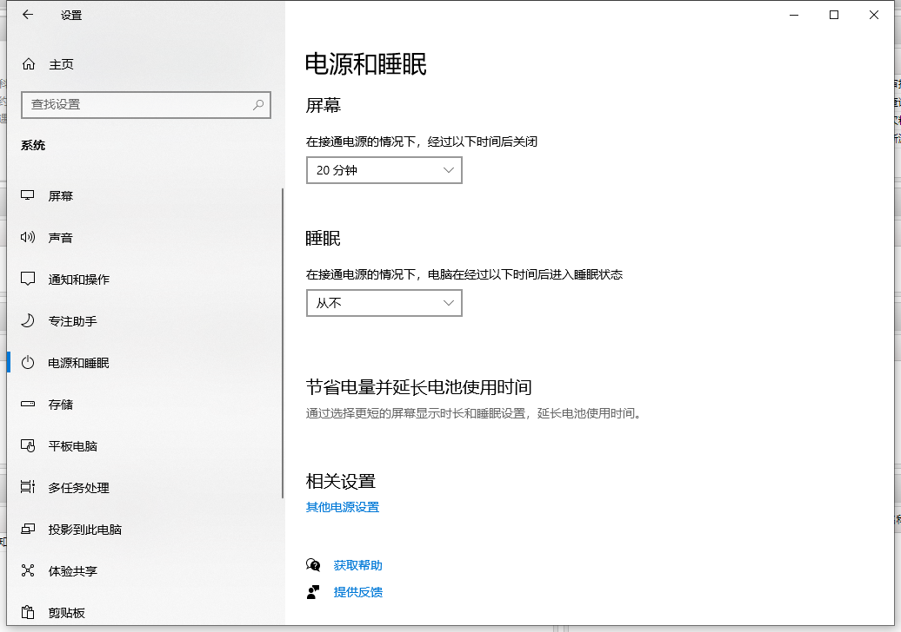
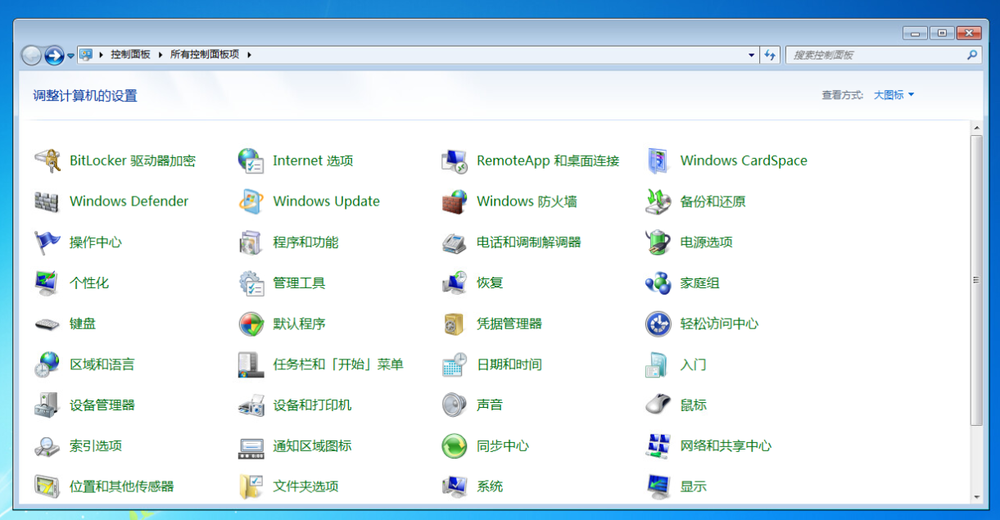
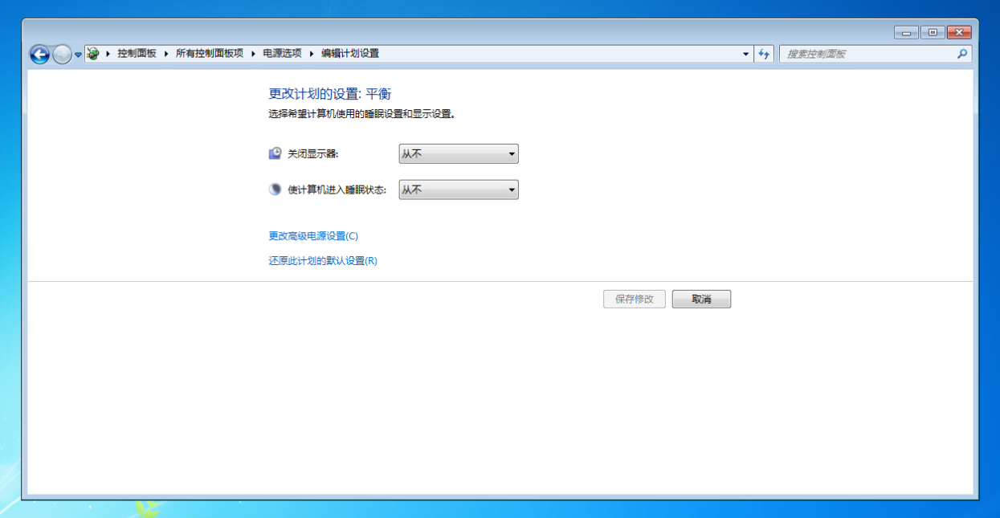

有时候，我们需要长时间离开座位或需要在家使用SSLVPN远程连接到公司电脑，但不希望电脑被休眠，此时就需要手动设置禁止电脑进入休眠状态。

已加域的电脑默认已阻止休眠，但由于一些特定问题，可能设置没有生效，可以按照以下办法设置：

## Win10

开始 - 设置 - 系统，将睡眠设置为“从不”

## Win7

开始菜单 - 控制面板，在窗口右上方有个“查看方式”，设置为“大图标”

然后点击“电源选项”

左侧功能菜单点击“更改计算机睡眠时间”

将“使计算机进入睡眠状态”设置为“从不”并确定

