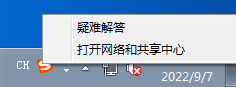
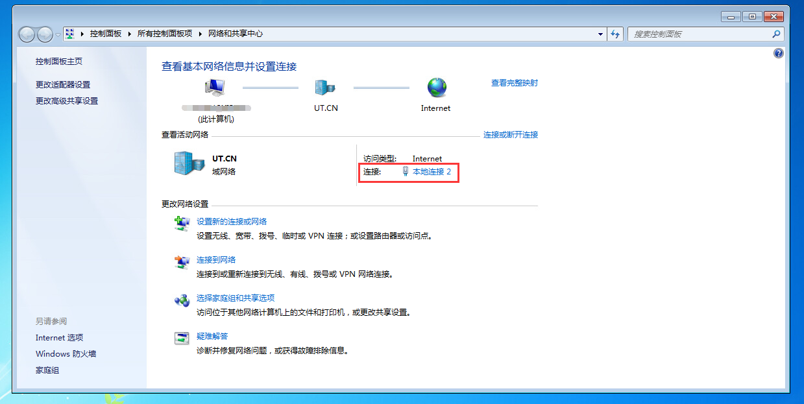
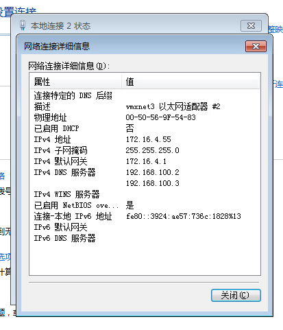
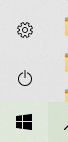
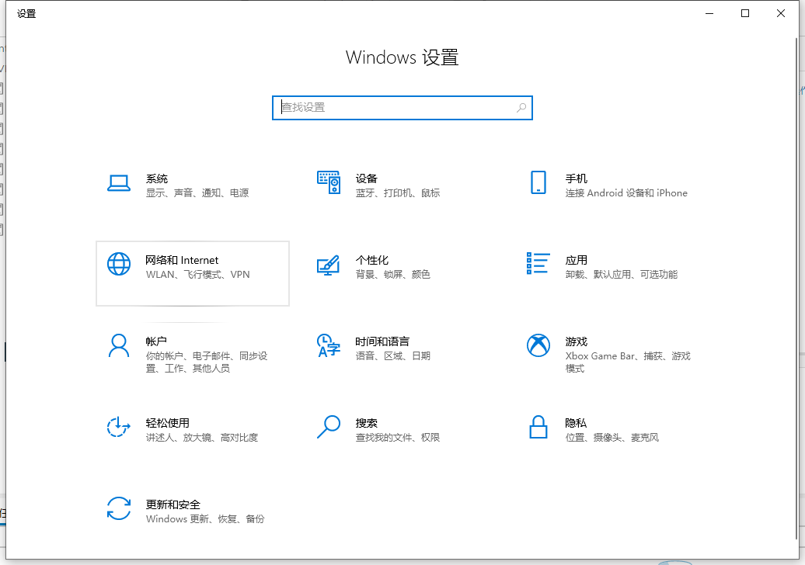
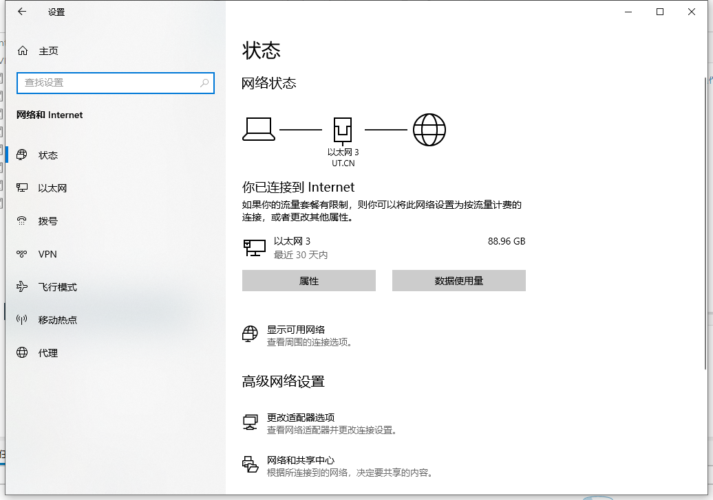
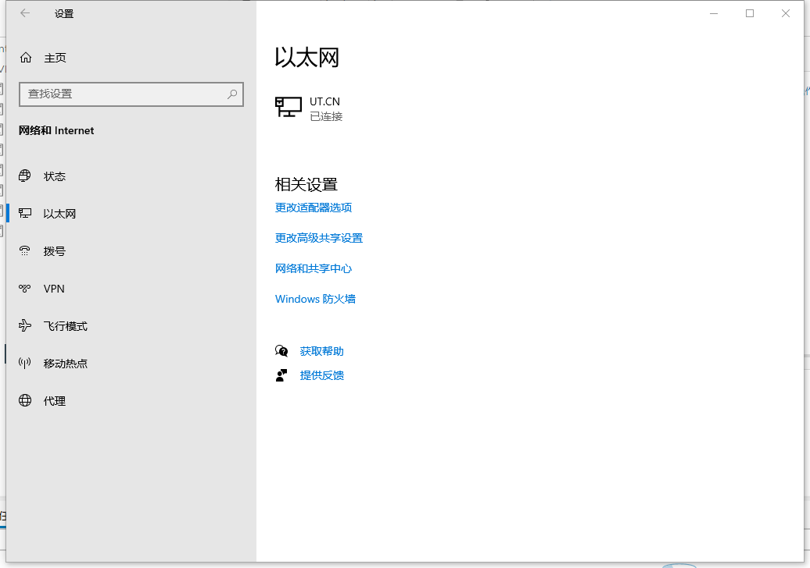
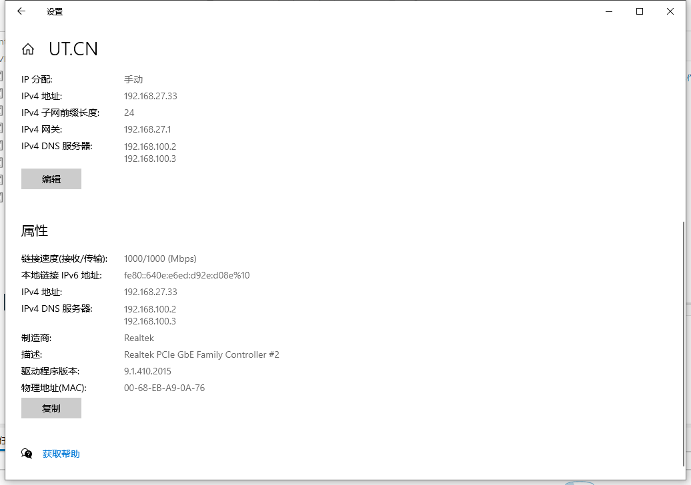

# 如何查看本机IP/MAC地址？

## Win 7

1. 右下角网络连接图标右键- 打开网络和共享中心
   
2. 在弹出页面点“本地连接”
   
3. 在弹出窗口点“详细信息”，显示内容即为您电脑IP / MAC 地址
   

## win 10

1. 开始菜单 - 设置

2. 在设置主页点击“网络和Internet”

3. 点击“以太网”

4. 点击“UT.CN” 或“本地连接”

5. 页面往下滚动即显示本地IP地址与MAC地址

