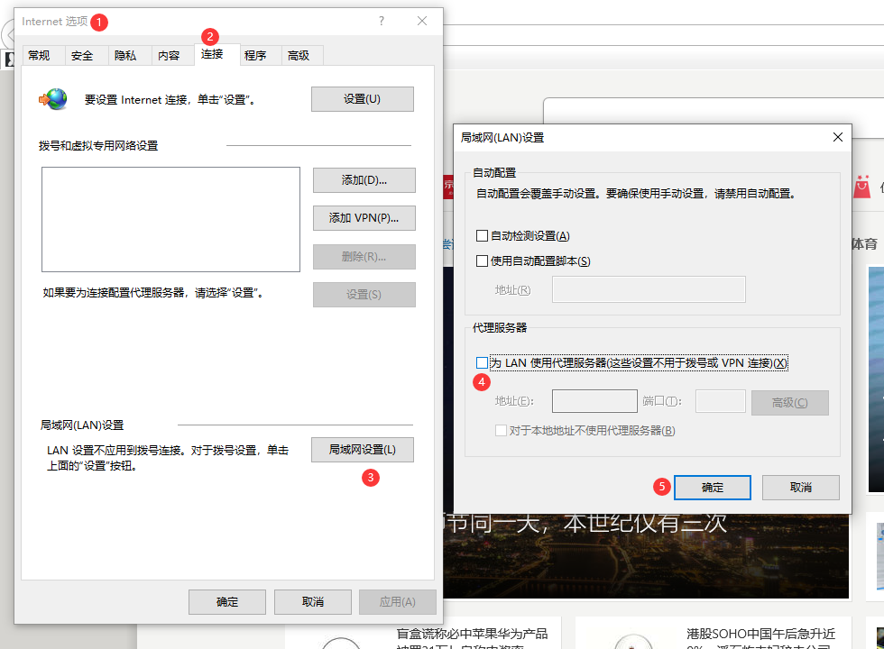
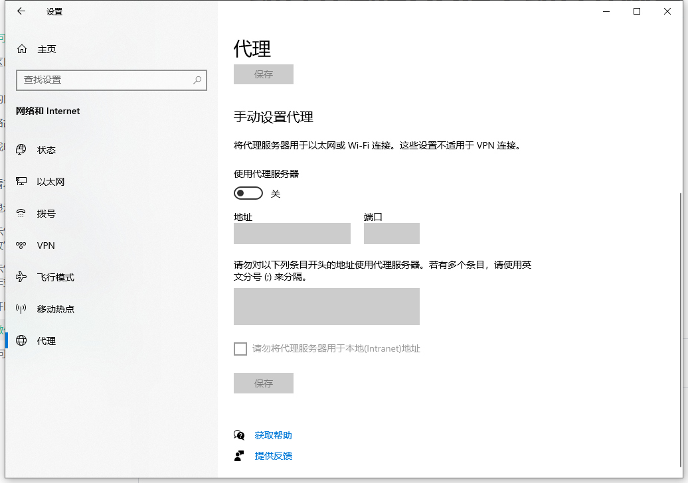
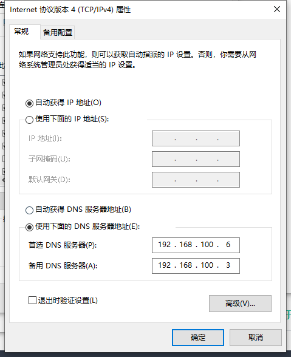

# 能打开微信QQ但不能打开网页

## 代理设置

请检查您是否设置了Internet代理服务器，如有设置请取消设置

### Win7

打开Internet选项

### Win10

打开设置 - 网络和Internet

## DNS设置

请检查网卡是否设置了错误的DNS设置，请将DNS设置为自动获取。或按以下操作设置

首选DNS服务器：192.168.100.6

备用DNS服务器：192.168.100.3

