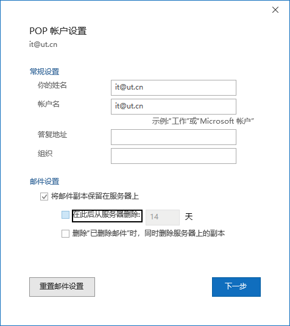
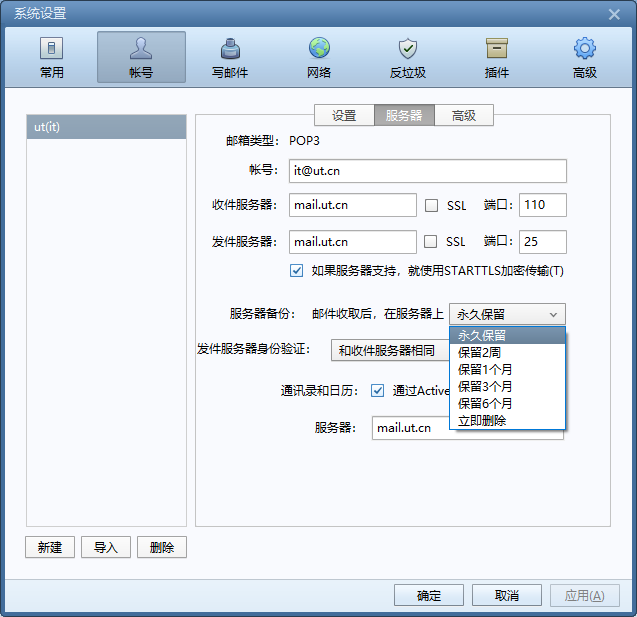

# 邮件被收取并删除，我应该如何避免这种情况？

当邮箱收件箱中的邮件被客户端以POP方式收取后，客户端会删除服务器上的邮件，删除原因与避免方法：

1. 使用Exchange或IMAP方式连接邮箱
2. 修改客户端设置
3. 您的邮箱在某台电脑设置了自动归档或者手动归档，请参考本文

#### **客户端参考设置**

##### Outlook

账户设置 - 邮件设置，勾选“将邮件副本保存在服务器上”，并取消勾选“在此后从服务器删除”

##### Foxmail

服务器备份中的“在服务器上”选择永久保留

