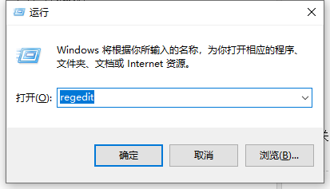

# 由于本机的限制，该操作已被取消

### 问题

点击Outlook邮件的链接提示以下错误：

###原因

由于安装了多个浏览器引起，即使卸载了其它的浏览器，注册表里没把IE默认浏览器所致。

### 解决办法

#### 方法1：

运行补丁程序解决：`\\192.168.100.5\Tools\补丁中心\Outlook连接不起作用修复\Outlook连接不起作用修复.msi`

#### 方法2：

1. 在【运行】里输入regedit并回车，调出【注册表】编辑页面

2. 地址栏输入：HKEY_CURRENT_USER\Software\Classes\.html

3. 双击“默认”，将弹出对话框中的【数值数据】改成：Htmlfile，并点击确认按钮

4. 重复步骤二，分别修改.htm数值

5. 关闭Outlook再重新打开
