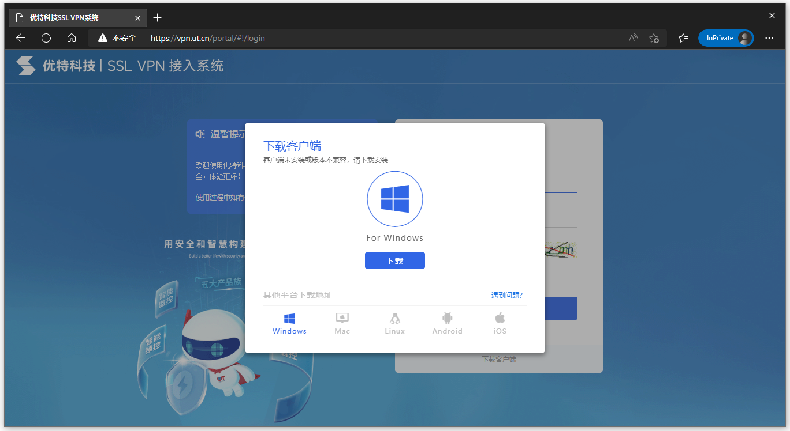
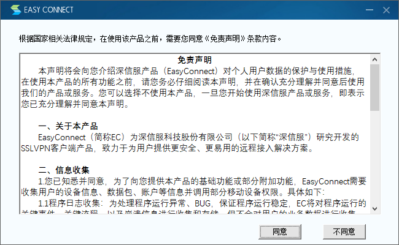
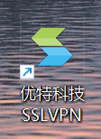
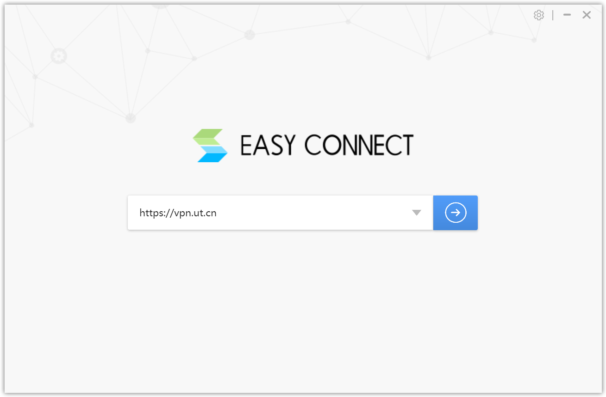
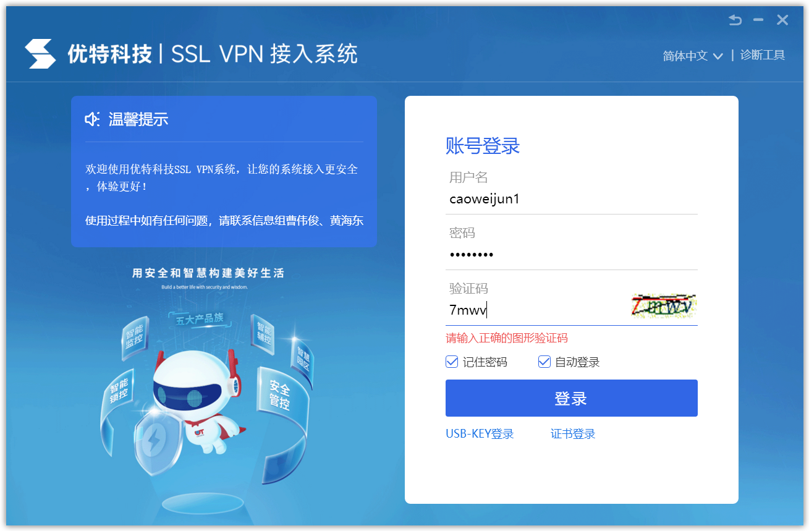
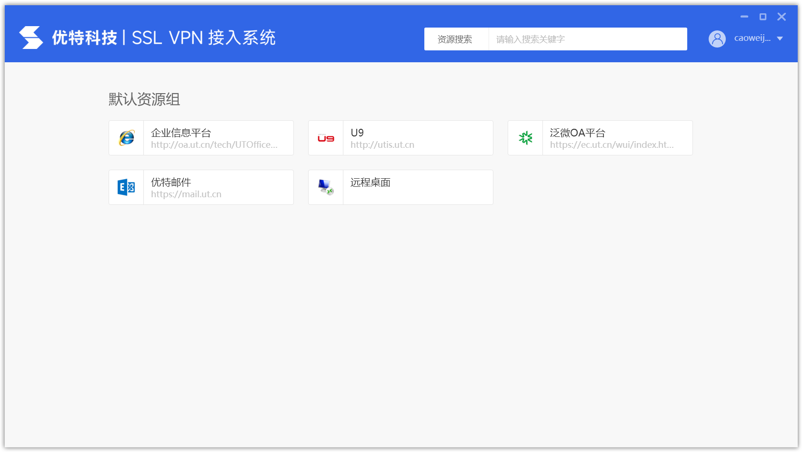

# 在Windows电脑上安装EasyConnect

使用浏览器打开：https://vpn.ut.cn

如果提示“你的连接不是专用连接” 或 “此网站的安全证书存在问题”，请点击“继续访问”

跳转到VPN登录页面，系统自动检测您电脑是否已安装客户端，如果未安装，系统会弹出页面提示下载安装

下载平台请选择“Windows”

下载后，安装程序右键“以管理员身份运行”安装

点击“同意”，系统会自动进行安装

安装完成后，双击桌面的“EasyConnect”或“优特科技SSLVPN”图标打开程序

在服务器地址界面输入公司VPN地址：`https://vpn.ut.cn`

点击蓝色箭头按钮，客户端开始连接VPN服务器，并跳转至登录界面

账户名为您域账户名，不带`@ut.cn`，密码为您域密码

登录成功后，系统跳转资源组页面，此时已连接至公司网络

