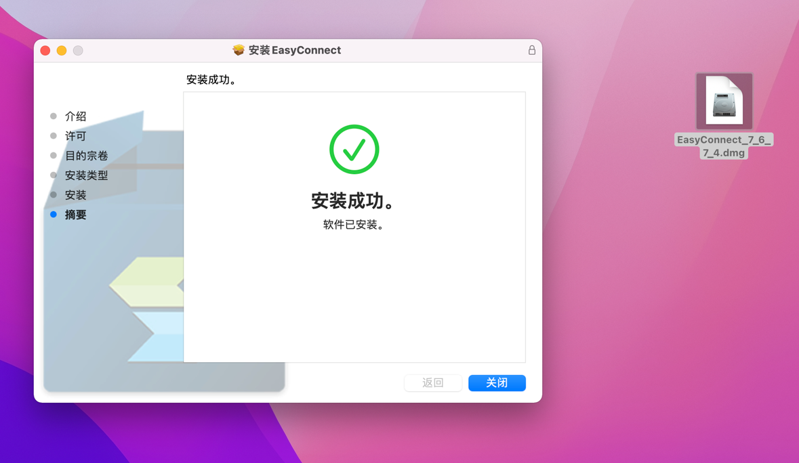

# 在macOS电脑上安装EasyConnect

:::caution

请不要使用**Safari**浏览器打开，他会无法弹出下载页面

:::
使用Chrome浏览器打开[https://vpn.ut.cn](https://vpn.ut.cn)

确认下载客户端选项卡是Mac，如果不是请点击Mac再下载

您会下载到一个**EasyConnect_7_6_7.dmg**,双击打开，按照界面提示输入密码进行安装

稍等片刻后，软件安装成功

在应用程序里面找到“Easy Connect"并打开

服务器页面输入公司VPN服务器地址：`https://vpn.ut.cn`

账户名为您域账户名，不带`@ut.cn`，密码为您域密码

登录成功后，系统跳转资源组页面，此时已连接至公司网络

