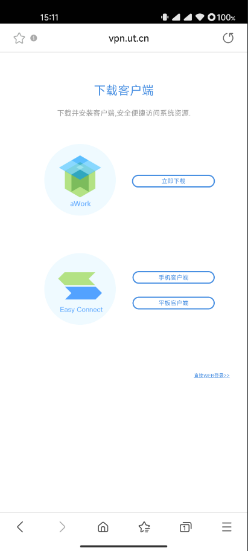
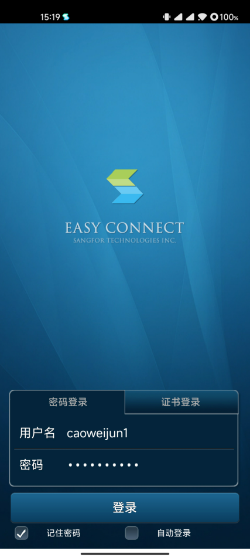
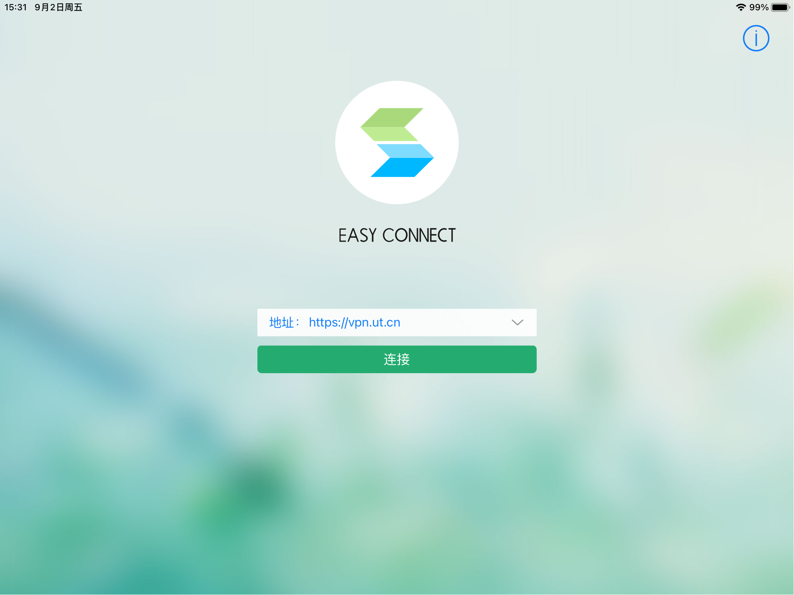
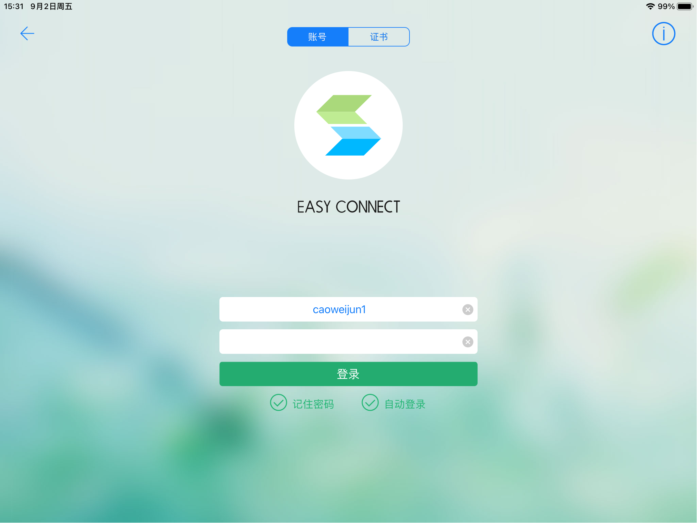
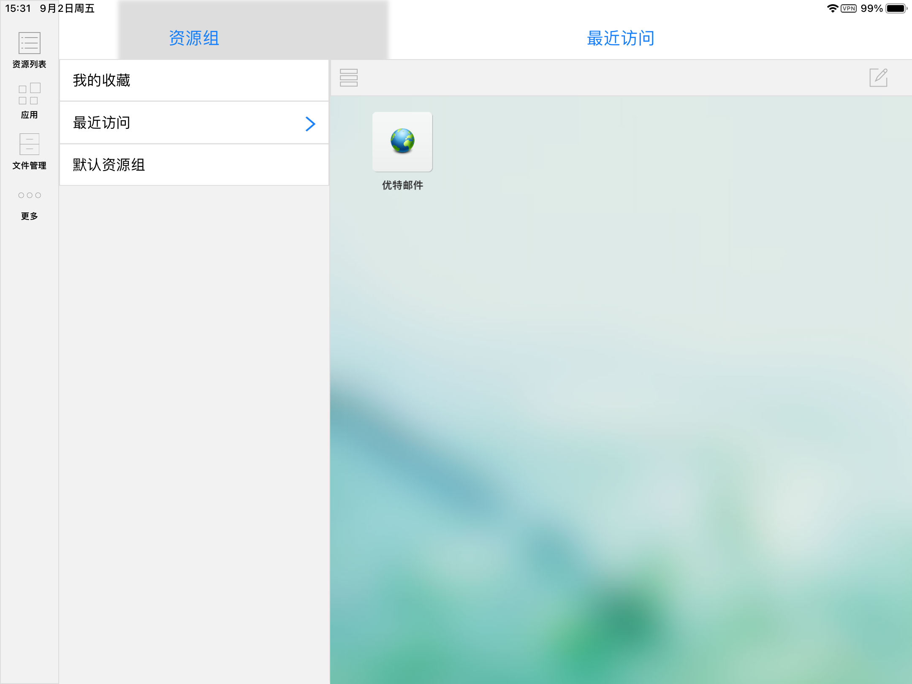

# 在您手机上安装Easyconnect

## 安卓系统

使用手机浏览器打开 [https://vpn.ut.cn](https://vpn.ut.cn)

请选择“EasyConnest”手机客户端下载并安装，安装后打开

在首页服务器地址输入`https://vpn.ut.cn`

账户名为您域账户名，不带`@ut.cn`，密码为您域密码

登录成功后，系统跳转资源组页面，此时已连接至公司网络

## iOS系统

在**App Store**商店搜索**Easy Connect**下载并打开

在首页服务器地址输入`https://vpn.ut.cn`

账户名为您域账户名，不带`@ut.cn`，密码为您域密码

登录成功后，系统跳转资源组页面，此时已连接至公司网络

