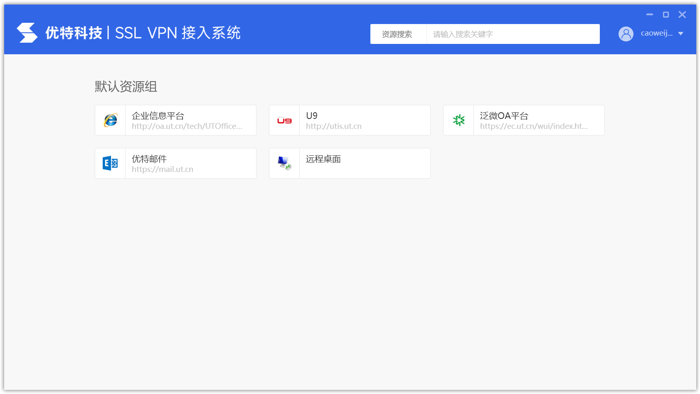
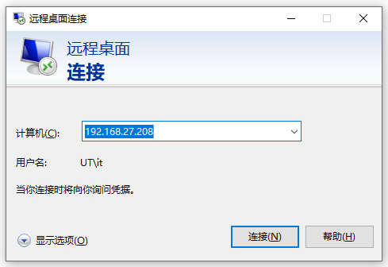
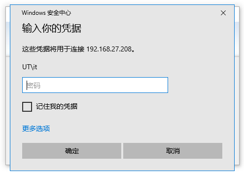
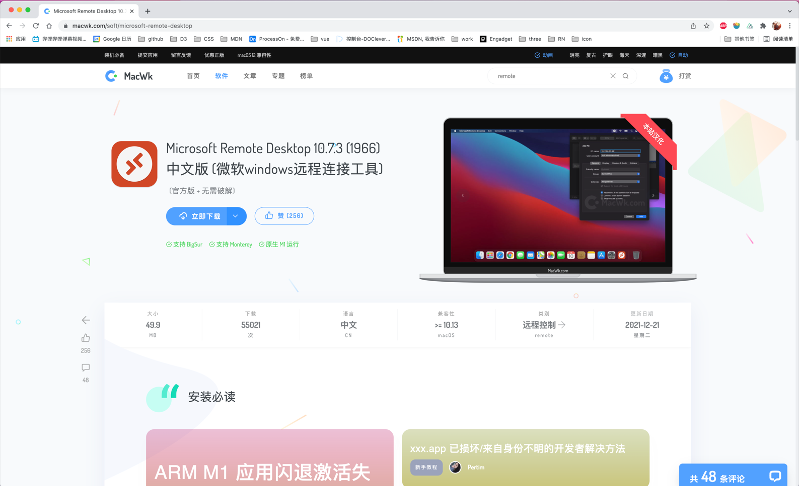
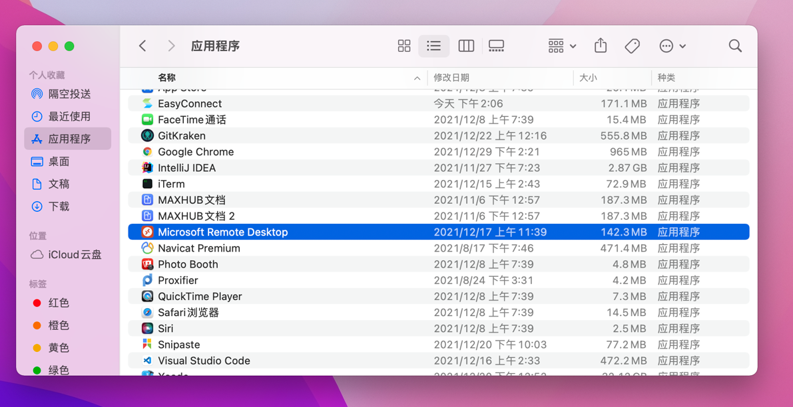
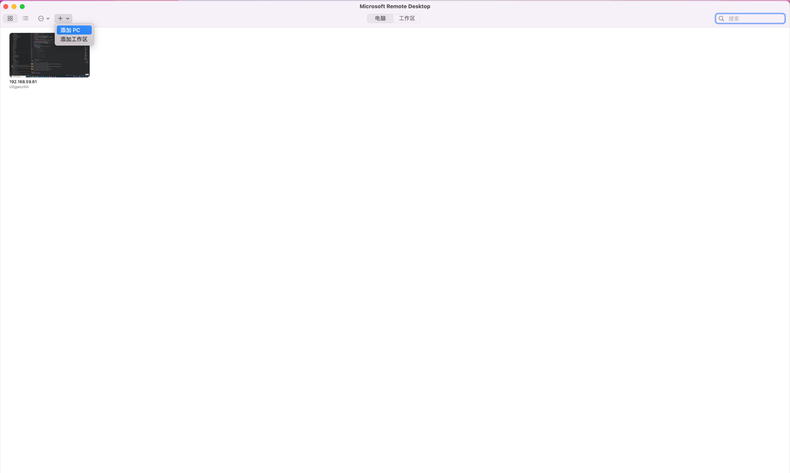
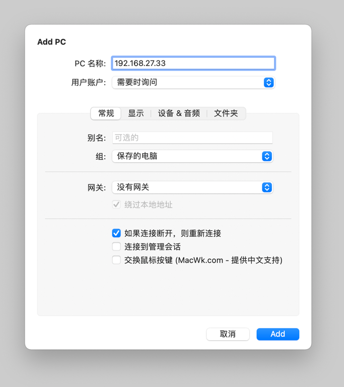
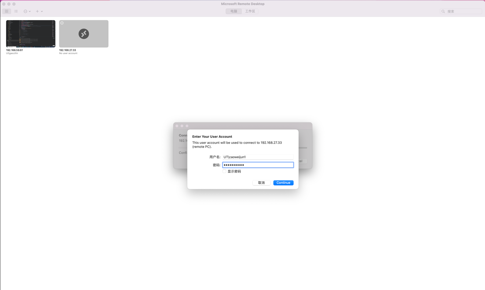
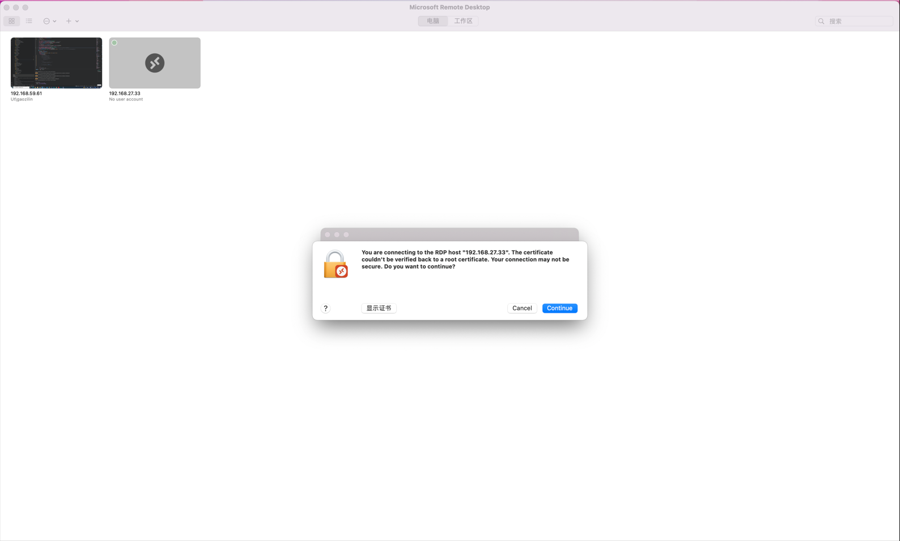

# 用电脑进行远程办公

## 先决条件

* 您已安装SSLVPN客户端
* 您已申请VPN权限
* 您的电脑已开启远程桌面，[如何开启远程桌面?](/question/SSLVPN问题/远程桌面设置)

## Windows

登录SSL VPN客户端后，点击“远程桌面”

计算机中输入您的计算机名，包含`.ut.cn` 如：zhangsan.ut.cn

或输入您的电脑IP地址

用户名为您域用户名，如我账户是it，则格式为：`UT\it`或`it@ut.cn`

密码为您域密码 / 电脑开机密码

点击确定即可远程连接至您办公电脑

## macOS系统

使用浏览器打开：[https://macwk.com/soft/microsoft-remote-desktop](https://macwk.com/soft/microsoft-remote-desktop)

下载并安装

安装后在应用程序中找到**Microsoft Remote Desktop**并打开

在主界面左上方选择“+”并点击“添加PC”

计算机中输入您的计算机名，包含`.ut.cn` 如：zhangsan.ut.cn

或输入您的电脑IP地址，然后点击Add

返回软件主界面，点击您刚添加的电脑，在弹出页面输入您的域账户与密码

用户名为您域用户名，如我账户是it，则格式为：`UT\it`或`it@ut.cn`

密码为您域密码 / 电脑开机密码

然后点击Continue

在询问界面继续点击Continue，即可连接至您的办公电脑

